# Enterprise Spec Framework Architecture Guide

## Purpose

This guide is the official architecture reference for the Enterprise Spec Framework (ESF). It documents the complete ESF architecture for Enterprise Architects, Senior Salesforce Architects, Framework Contributors, and Platform Engineers.

ESF extends Spec Kit with enterprise governance, product context, Salesforce standards, machine-readable rule catalogs, advisory validation, and product-team delivery guidance.

## 1. Vision

ESF exists to make enterprise governance usable inside daily delivery.

The vision:

- Product Teams describe business intent once and reuse it across specifications, plans, implementation, and validation.
- Platform Teams define enterprise standards once and distribute them through reusable knowledge packs.
- Delivery Teams receive the right context at the right time.
- Governance becomes evidence-driven and advisory before it becomes blocking.
- Salesforce delivery becomes more consistent, traceable, secure, testable, and operable.

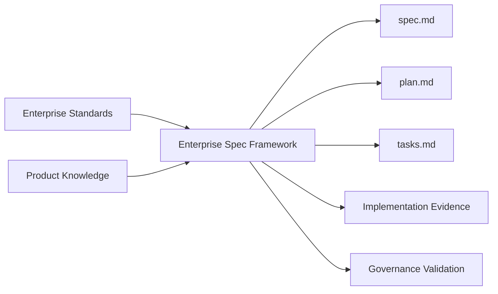

## 2. Architecture Principles

ESF follows these principles:

1. Governance must be explicit.
2. Product ownership must remain with Product Teams.
3. Enterprise rules must remain platform-owned.
4. Context loading must be deterministic.
5. Rules should be data, not hard-coded Python logic.
6. Validation should be advisory before it is blocking.
7. Prompt behavior must match documented loader behavior.
8. Backward compatibility matters.
9. Missing governance files should warn, not crash, unless configuration is malformed.
10. AI assistance must be traceable and reviewable.

## 3. Enterprise Governance Model

Enterprise governance defines cross-product guardrails.

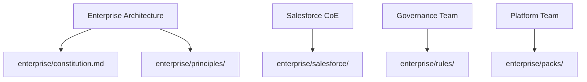

Enterprise governance owns:

- Architecture principles.
- Security expectations.
- Compliance expectations.
- Salesforce engineering standards.
- Rule packs.
- Root Enterprise Governance source files.
- Bootstrap recipe definitions.
- Context loading behavior.
- Governance validation behavior.

Enterprise governance does not own:

- Product-specific business rules.
- Product vocabulary.
- Feature acceptance criteria.
- Jira prioritization.

## 4. Product Governance Model

Product governance defines product-specific meaning and rules.

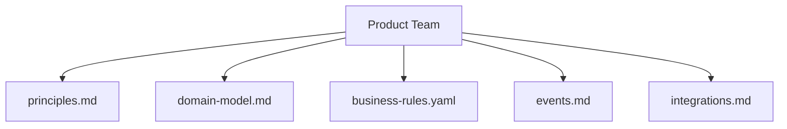

Product governance owns:

- Product principles.
- Product domain model.
- Product business rules.
- Product events.
- Product integrations.
- Product-specific terminology.

Product governance files live under:

```text
products/<product-name>/
```

## 5. ESF Repository Architecture

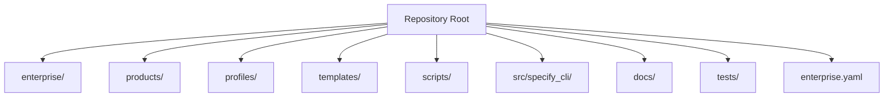

Folder hierarchy:

```text
spec-kit/
|-- enterprise/
|   |-- constitution.md
|   |-- principles/
|   |-- salesforce/
|   |-- rules/
|   `-- packs/
|-- products/
|   `-- <product-name>/
|       |-- principles.md
|       |-- domain-model.md
|       |-- business-rules.yaml
|       |-- events.md
|       `-- integrations.md
|-- profiles/
|   `-- salesforce-enterprise/
|-- templates/
|   `-- commands/
|-- scripts/
|-- src/
|   `-- specify_cli/
|-- docs/
|-- tests/
`-- enterprise.yaml
```

Folder ownership:

| Folder | Owner | Purpose |
| --- | --- | --- |
| `enterprise/` | Platform Team | Enterprise standards, rules, packs. |
| `products/` | Product Teams | Product-specific governance context. |
| `profiles/` | Platform Team | Bootstrap recipes and product starter templates; not runtime Enterprise Governance. |
| `templates/commands/` | Platform Team / Spec Kit Core | AI command prompt templates. |
| `scripts/` | Platform Engineering | CLI wrappers for loaders and validators. |
| `src/specify_cli/` | Framework Contributors | Python implementation. |
| `docs/` | Platform Team | Published documentation. |
| `tests/` | Framework Contributors | Automated test coverage. |

## 6. Bootstrap Architecture

Bootstrap creates new ESF-ready projects.

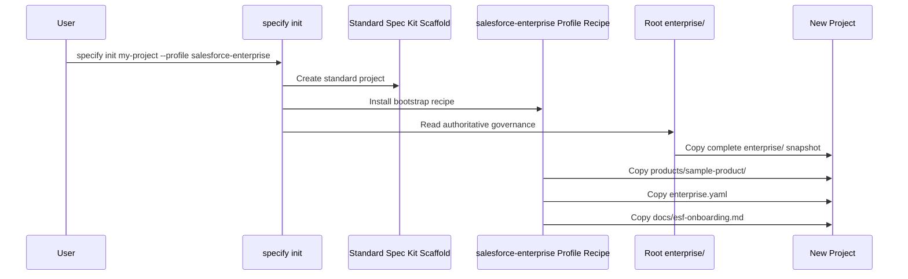

Bootstrap source:

```text
enterprise/                              # Platform-owned governance source
profiles/salesforce-enterprise/          # Bootstrap recipe and product templates
```

`profiles/salesforce-enterprise/` must not contain duplicate enterprise constitution, Salesforce standards, or enterprise rule samples. If a generated project needs Enterprise Governance, bootstrap copies it from root `enterprise/`.

Bootstrap output:

```text
enterprise/
products/sample-product/
enterprise.yaml
docs/esf-onboarding.md
specs/
```

After bootstrap, runtime governance is loaded only from the generated project:

```text
enterprise/
products/<product-name>/
```

The bootstrap profile is not consulted by the Context Loader.

## 7. Context Loader Architecture

The Context Loader is the deterministic discovery layer.

Source:

```text
src/specify_cli/enterprise_context.py
scripts/load-enterprise-context.py
```

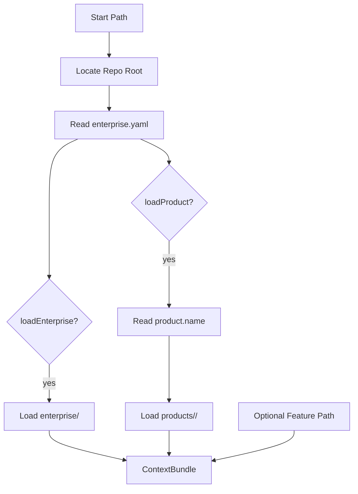

Context loading order:

1. `enterprise/constitution.md`
2. `enterprise/principles/*.md`
3. `enterprise/salesforce/**/*.md`
4. `products/<product-name>/`
5. optional feature specification

Product loading order:

1. `principles.md`
2. `domain-model.md`
3. `business-rules.yaml`
4. `events.md`
5. `integrations.md`
6. other `.md`, `.yaml`, `.yml` files alphabetically

## 8. Governance Engine Architecture

The Governance Engine evaluates generated artifacts against rules.

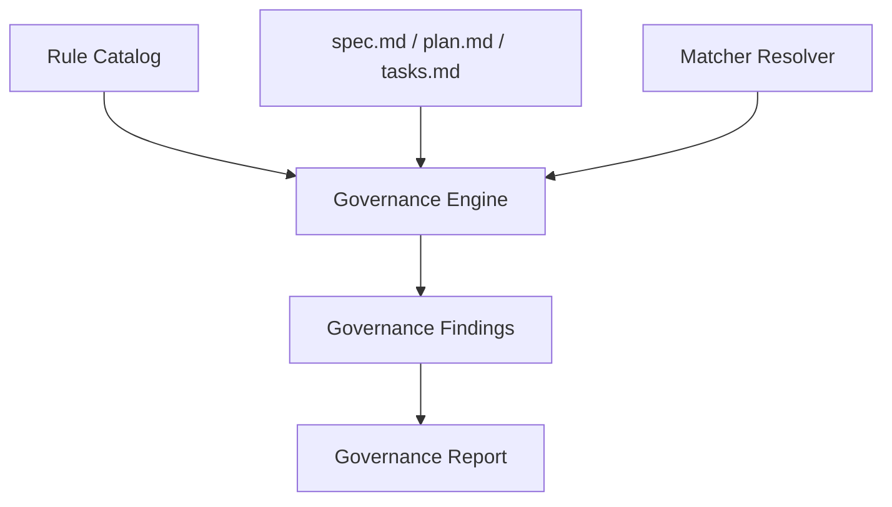

Primary modules:

| Module | Purpose |
| --- | --- |
| `rule_catalog.py` | Loads YAML rule data. |
| `framework/engine/governance_engine.py` | Evaluates artifacts against applicable rules. |
| `framework/matchers/` | Implements evidence matching strategies. |
| `framework/reports/` | Produces structured findings and reports. |
| `governance_validation.py` | CLI-level validation orchestration. |

## 9. Practice Compliance Engine

Practice Compliance is an evidence matcher for structured practice rules.

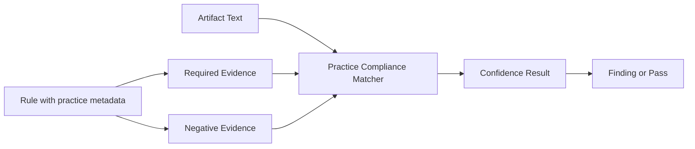

Practice metadata example:

```yaml
practice:
  type: salesforce_apex_bulkification
  min_confidence: 0.7
required_evidence:
  - processes records in collections
negative_evidence:
  - DML inside loop
evidence_terms:
  processes records in collections:
    - collections
    - bulk records
  DML inside loop:
    - DML inside loop
```

Practice Compliance is not a semantic proof system. It is a structured evidence matcher that supports advisory governance.

## 10. Knowledge Pack Architecture

Knowledge Packs group related enterprise standards and rules.

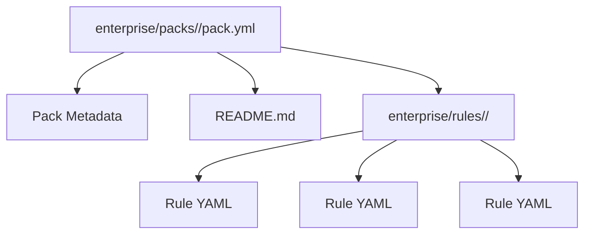

Current Salesforce packs:

| Pack | Rule Prefix | Purpose |
| --- | --- | --- |
| `salesforce-security` | `SFSEC` | Salesforce security rules. |
| `salesforce-apex` | `SFAPEX` | Apex engineering rules. |
| `salesforce-flow` | `SFFLOW` | Flow governance rules. |
| `salesforce-integration` | `SFINT` | Integration rules. |
| `salesforce-testing` | `SFTEST` | Testing rules. |
| `salesforce-architecture` | `SFARCH` | Architecture rules. |

## 11. Rule Catalog

The Rule Catalog is the machine-readable source of truth.

```text
enterprise/rules/**/*.yaml
  |
  v
RuleLoader
  |
  v
RuleCollection
  |
  v
GovernanceEngine
```

Rule Catalog responsibilities:

- Discover rule files.
- Parse YAML.
- Preserve unknown metadata fields.
- Return warnings and errors.
- Group rules by category and applies-to target.

Rule Catalog does not:

- Enforce rules.
- Block delivery.
- Interpret AI output.
- Resolve exceptions.

## 12. Rule Schema

Required rule fields:

| Field | Type | Purpose |
| --- | --- | --- |
| `id` | string | Stable rule identifier. |
| `title` | string | Human-readable title. |
| `category` | string | Governance category. |
| `description` | string | What the rule expects. |
| `rationale` | string | Why the rule exists. |
| `severity` | string | Advisory, warning, blocking. |
| `default_enabled` | boolean | Whether the rule is active by default. |
| `applies_to` | list | Artifacts or technologies affected. |
| `keywords` | list | Basic matcher terms. |
| `recommendation` | string | Suggested remediation. |
| `references` | list | Supporting docs. |
| `owner` | string | Owning team. |
| `version` | string | Rule version. |

Recommended metadata:

| Field | Purpose |
| --- | --- |
| `rule_pack` | Owning knowledge pack. |
| `domain` | Business or technology domain. |
| `topic` | Rule topic. |
| `required_evidence` | Evidence expected. |
| `negative_evidence` | Anti-patterns. |
| `examples` | Compliant and non-compliant examples. |
| `practice` | Practice Compliance metadata. |

## 13. Rule Resolution

Rule resolution selects applicable rules for an artifact.

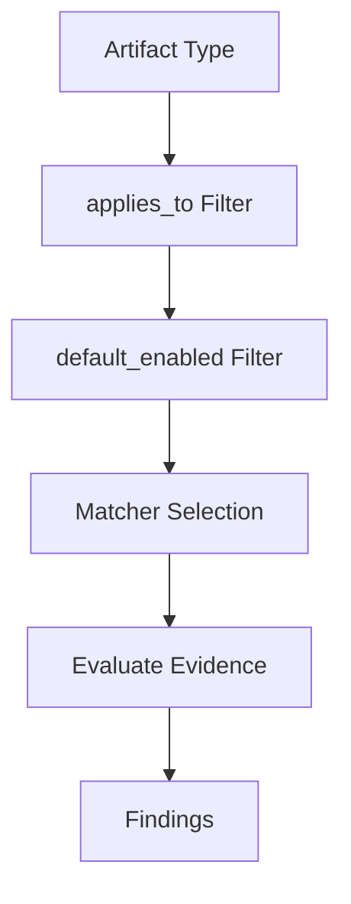

Resolution dimensions:

- Artifact type: `specification`, `plan`, `tasks`, `apex`, `flow`, etc.
- Category.
- Rule enabled state.
- Matcher mode.
- Future exception metadata.

Current behavior is intentionally simple and advisory.

## 14. Dynamic Product Context

Dynamic Product Context allows Product Teams to update product files without changing platform code.

```yaml
product:
  name: rdra
```

Runtime path:

```text
products/rdra/
```

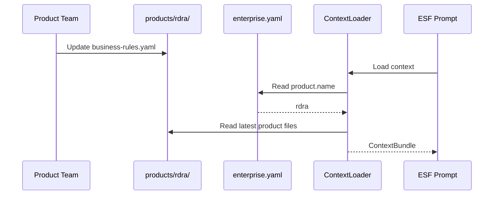

Supported product files:

- `principles.md`
- `domain-model.md`
- `business-rules.yaml`
- `events.md`
- `integrations.md`
- future `.md`, `.yaml`, `.yml`

## 15. Enterprise Context

Enterprise Context is platform-owned and cross-product.

Enterprise context includes:

```text
enterprise/constitution.md
enterprise/principles/*.md
enterprise/salesforce/**/*.md
enterprise/rules/**/*.yaml
enterprise/packs/**
```

Enterprise context guides:

- Security.
- Architecture.
- Scalability.
- Compliance.
- Salesforce Apex.
- Salesforce Flow.
- Salesforce LWC.
- Testing.
- Deployment.

## 16. Prompt Architecture

Prompt templates instruct AI agents how to use ESF context.

```text
templates/commands/
|-- specify.md
|-- plan.md
|-- tasks.md
|-- implement.md
`-- ...
```

Prompt responsibilities:

- Tell the AI to use the Enterprise Context Loader.
- Explain that Enterprise Governance comes from `enterprise/`.
- Explain that Product Governance comes from `products/<product-name>/`, selected by `enterprise.yaml`.
- Warn agents not to rely only on `.specify/memory/constitution.md`.
- Explain dynamic product context.
- Preserve Spec Kit workflow semantics.
- Dispatch extension hooks.
- Define expected outputs.
- Keep specification prompts focused on what and why.
- Keep planning prompts focused on how and evidence.

## 17. Prompt Flow

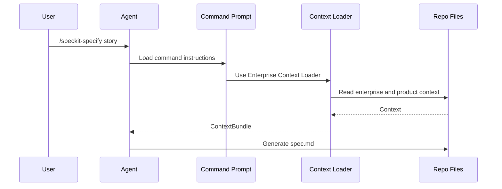

Prompt flow differs by command:

| Command | Primary Output | Governance Focus |
| --- | --- | --- |
| `/speckit-specify` | `spec.md` | Business requirements and product rules. |
| `/speckit-plan` | `plan.md` and design artifacts | Architecture, standards, risk, exceptions. |
| `/speckit-tasks` | `tasks.md` | Implementation and evidence work. |
| `/speckit-implement` | Code and completed tasks | Execution against plan and constraints. |

## 18. AI Integration

ESF supports multiple AI agent integrations through Spec Kit integration packages.

Integration architecture:

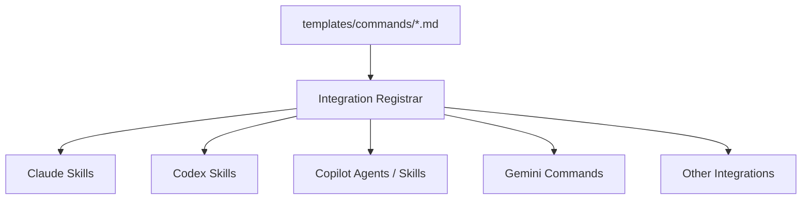

AI integration rules:

- Generated prompts must preserve governance context instructions.
- Agent-specific command names may vary.
- Skills-based integrations often use hyphenated commands such as `/speckit-plan`.
- Governance behavior should not depend on one AI vendor.

## 19. Command Flow

```mermaid
flowchart TD
    Specify[/speckit-specify] --> Spec[spec.md]
    Spec --> Plan[/speckit-plan]
    Plan --> PlanDoc[plan.md]
    PlanDoc --> Tasks[/speckit-tasks]
    Tasks --> TasksDoc[tasks.md]
    TasksDoc --> Implement[/speckit-implement]
    Implement --> Code[Implementation]
    Code --> Validate[validate-governance]
```

Command outputs:

| Command | Output |
| --- | --- |
| `specify init` | Project scaffold. |
| `/speckit-specify` | Feature directory, `spec.md`, checklist. |
| `/speckit-plan` | `plan.md`, `research.md`, `data-model.md`, contracts, quickstart. |
| `/speckit-tasks` | `tasks.md`. |
| `/speckit-implement` | Completed tasks and implementation. |
| `validate-governance` | Governance report. |

## 20. Bootstrap Flow

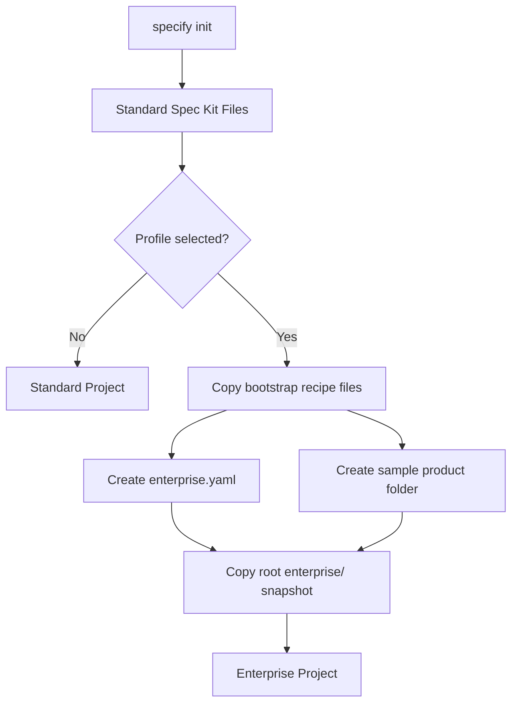

Bootstrap constraints:

- Profile is optional.
- The profile is a recipe; root `enterprise/` is the Enterprise Governance source.
- Existing files are preserved unless force behavior is requested.
- Bootstrap does not sync future platform updates.
- Product Teams should rename `sample-product`.

## 21. Validation Flow

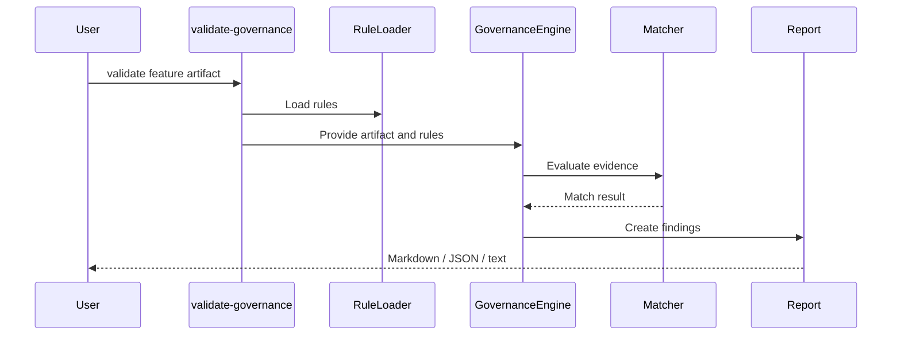

Validation characteristics:

- Advisory by default.
- Data-driven rules.
- Supports keyword matching.
- Supports Practice Compliance matcher.
- Reports missing evidence and negative evidence.

## 22. Extension Points

Extension point table:

| Extension Point | Location | Current Status | Use |
| --- | --- | --- | --- |
| Command templates | `templates/commands/` | Active | Change agent instructions. |
| Enterprise context | `enterprise/` | Active | Add standards. |
| Product context | `products/` | Active | Add product-specific rules. |
| Rule catalog | `enterprise/rules/` | Active | Add machine-readable rules. |
| Knowledge packs | `enterprise/packs/` | Active | Group rules and standards. |
| Matchers | `src/specify_cli/framework/matchers/` | Active | Add evidence evaluation strategies. |
| Extensions | `extensions/` | Active | Add hook-driven workflows. |
| Bootstrap profiles | `profiles/` | Active | Add project scaffolds. |
| Plugins | Future | Planned | Installable external capabilities. |

## 23. Future Plugin Architecture

Future plugin architecture should support independently versioned ESF capabilities.

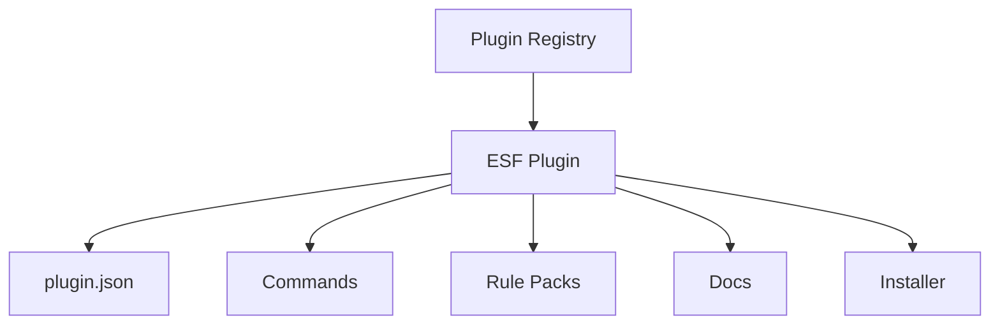

Plugin principles:

- Explicit manifest.
- Versioned install.
- No hidden network dependency during validation.
- Clear ownership.
- Clear compatibility.
- Safe uninstall path.

Potential plugin types:

- Industry rule packs.
- Salesforce cloud-specific packs.
- CI validation adapters.
- Reporting exporters.
- Exception workflow adapters.

## 24. Future Knowledge Pack Architecture

Future Knowledge Packs should be installable, versioned, and compatible with ESF.

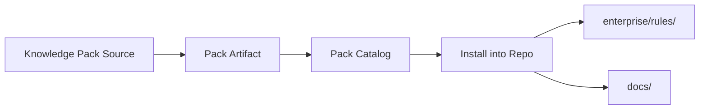

Future pack metadata:

```yaml
name: salesforce-health-cloud
version: "1.0.0"
minimum_esf_version: "1.2.0"
owner: Salesforce CoE
rules:
  root: enterprise/rules/salesforce-health-cloud
docs:
  - docs/health-cloud.md
```

## 25. Security Model

Security model principles:

- ESF reads local files.
- ESF should not require remote product sync.
- Product context is repository content.
- Enterprise rules are repository content.
- Validation is advisory by default.
- Secrets must not be stored in rules, product files, or docs.

Security boundaries:

| Boundary | Risk | Control |
| --- | --- | --- |
| Product files | Bad or misleading product rules | PR review. |
| Enterprise rules | Incorrect governance | Domain owner approval. |
| Prompt templates | Unsafe agent behavior | Platform review and tests. |
| Validation engine | False findings | Tests and advisory rollout. |
| AI output | Hallucinated decisions | Human review and traceability. |

AI security considerations:

- Do not put secrets in product context.
- Do not put regulated data examples in prompts.
- Keep governance files reviewable.
- Treat AI-generated artifacts as drafts.

## 26. Performance Considerations

Performance considerations:

- Context Loader reads local files only.
- Product folders should remain focused.
- Rule catalog loading is file-based and deterministic.
- Validation cost grows with rule count and artifact size.
- Practice Compliance matching can be more expensive than keyword matching.

Performance guidance:

- Keep product context concise.
- Avoid dumping complete operational manuals into product files.
- Prefer rule metadata over repeated prose.
- Group rules by pack.
- Cache only if future performance evidence requires it.

## 27. Scalability

ESF must scale across Product Teams.

Scalability dimensions:

| Dimension | Current Approach | Future Need |
| --- | --- | --- |
| Product count | One active product per repo config | Multi-product loading if approved. |
| Rule count | YAML file discovery | Pack indexes and caching if needed. |
| Teams | Git-based ownership | Ownership metadata and dashboards. |
| Validation | Advisory CLI | CI integration. |
| Knowledge packs | Local folders | Pack registry or installer. |

Current non-goals:

- Remote product sync.
- Database-backed rules.
- Jira integration.
- UI.
- Product aliases.
- Multi-product loading.
- Blocking validation by default.

## 28. Versioning

ESF uses multiple version layers.

| Layer | Example | Owner |
| --- | --- | --- |
| ESF version | `1.2.0` | Platform Team |
| Rule version | `SFSEC-001@1.0.0` | Rule owner |
| Pack version | `salesforce-security@1.0.0` | Pack owner |
| Product context version | Git history | Product Team |
| Bootstrap profile version | ESF release | Platform Team |

Version compatibility:

| ESF | Context Loader | Rule Schema | Pack Compatibility |
| --- | --- | --- | --- |
| `1.0.x` | Enterprise and product markdown | Required rule fields | Baseline packs |
| `1.1.x` | Product YAML support | Metadata preserved | Compatible with `1.0.x` rules |
| `1.2.x` | Dynamic business rules | Business rules docs | Preferred for Product Teams |
| `2.0.x` | Future | Possible breaking changes | Migration required |

## 29. Release Strategy

Release strategy:

- Patch releases for fixes and documentation.
- Minor releases for new packs, docs, or advisory capabilities.
- Major releases for breaking schema, loader, or validation changes.

Release workflow:


Release checklist:

- [ ] Tests pass.
- [ ] Rule catalog loads.
- [ ] Context Loader loads configured product.
- [ ] Bootstrap profile works.
- [ ] Docs updated.
- [ ] Changelog updated.
- [ ] Migration notes included.
- [ ] Release tag created.

Release history table:

| Version | Theme | Notes |
| --- | --- | --- |
| `1.0` | Enterprise governance foundation | Constitution, principles, initial docs. |
| `1.1` | Rule catalog and advisory validation | Machine-readable rules and validation. |
| `1.2` | Product bootstrap and dynamic context | Salesforce profile and product business rules. |
| Future | Pack publishing and CI integration | Planned capabilities. |

## 30. Backward Compatibility

Compatibility commitments:

- Standard `specify init` behavior remains unchanged without profile.
- Missing `enterprise.yaml` disables enterprise loading with warning.
- Unknown future rule fields are preserved as metadata.
- Product business rules are additive.
- Validation remains advisory unless explicitly changed.

Breaking changes include:

- Removing required rule fields.
- Changing product context ordering.
- Changing command output paths.
- Making advisory validation blocking.
- Requiring remote services for local validation.

## 31. Coding Standards

Python coding standards:

- Keep loaders deterministic.
- Use structured parsing for YAML.
- Preserve unknown metadata where schema may evolve.
- Return warnings instead of crashing for missing optional files.
- Raise clear errors for malformed required config.
- Keep CLI wrappers thin.
- Add tests for behavior changes.

Repository standards:

- Use `rg` for search.
- Keep generated docs in Markdown.
- Keep enterprise examples realistic.
- Avoid unrelated refactors.
- Maintain backward compatibility.

Public APIs:

| API | Type | Stability | Purpose |
| --- | --- | --- | --- |
| `ContextLoader.load()` | Python | Supported | Load enterprise/product context. |
| `ContextBundle.to_dict()` | Python | Supported | Structured context output. |
| `ContextBundle.render_markdown()` | Python | Supported | Human/prompt context rendering. |
| `RuleLoader.load()` | Python | Supported | Load rule catalog. |
| `RuleCollection.to_json()` | Python | Supported | Render rule data. |
| `scripts/load-enterprise-context.py` | CLI | Supported | Context inspection. |
| `scripts/load-rules.py` | CLI | Supported | Rule inspection. |
| `scripts/validate-governance.py` | CLI | Supported | Advisory validation. |

## 32. Testing Strategy

Testing layers:

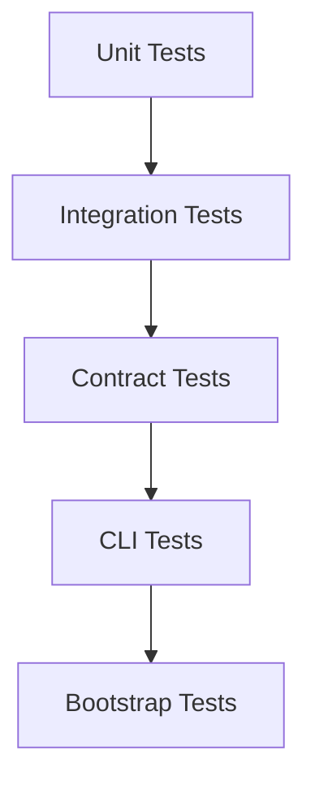

Key test areas:

- Context Loader ordering.
- Product selection from `enterprise.yaml`.
- Missing file warnings.
- Rule catalog required fields.
- Duplicate rule IDs.
- Governance engine matching.
- Bootstrap profile generation.
- Prompt template content.

Recommended commands:

```bash
python -m pytest tests/test_enterprise_context_loader.py -v
python -m pytest tests/test_rule_catalog.py -v
python -m pytest tests/test_governance_engine.py -v
python -m pytest tests/test_project_bootstrap.py -v
```

## 33. CI/CD Future Vision

Future CI/CD integration should validate ESF artifacts automatically.

```mermaid
flowchart TD
    PR[Pull Request] --> Lint[Markdown/YAML Lint]
    PR --> Tests[Python Tests]
    PR --> RuleCheck[Rule Catalog Check]
    PR --> ContextCheck[Context Loader Check]
    PR --> GovCheck[Governance Advisory Report]
    GovCheck --> PRComment[PR Comment]
```

Future CI checks:

- YAML parse.
- Required rule fields.
- Duplicate rule IDs.
- Pack metadata.
- Context loading.
- Prompt template assertions.
- Governance validation report.
- Documentation links.

CI should start advisory. Blocking gates should be introduced only after false positives are low.

## 34. AI Governance

AI Governance ensures AI-generated output is reviewable.

Principles:

- AI output is draft output.
- Human owners approve business and architecture decisions.
- Agent authorship must be disclosed in commits and review comments.
- Prompts must direct agents to use ESF context.
- Product rules must not be invented by AI when product files are silent.
- Exceptions must be explicit.

AI governance flow:

```mermaid
flowchart LR
    Prompt[Governed Prompt] --> AI[AI Agent]
    AI --> Draft[Draft Artifact]
    Draft --> Review[Human Review]
    Review --> Evidence[Approved Evidence]
```

Controls:

- Prompt templates.
- Context Loader.
- Rule validation.
- PR review.
- Commit trailers.
- Documentation standards.

## 35. Risks

Risk register:

| Risk | Impact | Mitigation |
| --- | --- | --- |
| Stale product files | Generated specs use outdated rules | Product ownership and dynamic loading. |
| Overly generic rules | Weak validation | Rule authoring standards and review. |
| Conflicting packs | Confusing guidance | Architecture review and duplicate checks. |
| AI ignores context | Poor artifacts | Prompt tests and explicit command guidance. |
| False positives | Validation fatigue | Advisory rollout and matcher tuning. |
| Premature blocking | Delivery disruption | Keep advisory until mature. |
| Rule sprawl | Hard maintenance | Pack lifecycle and versioning. |
| Product ownership ambiguity | Unclear decisions | Product onboarding checklist. |

## 36. Future Roadmap

Roadmap themes:

```mermaid
timeline
    title ESF Future Roadmap
    Phase 1 : Governance foundation
            : Enterprise constitution
            : Product context
    Phase 2 : Context automation
            : Dynamic product context
            : Business rules
    Phase 3 : Advisory validation
            : Rule catalog
            : Governance engine
    Phase 4 : Knowledge packs
            : Pack versioning
            : Pack publishing
    Phase 5 : CI integration
            : PR comments
            : Quality dashboards
    Phase 6 : Managed enforcement
            : Exception workflow
            : Blocking gates where approved
```

Future capabilities:

- Knowledge Pack installer.
- Pack registry.
- Product onboarding automation.
- CI advisory comments.
- Exception registry.
- Rule deprecation tooling.
- Governance dashboards.
- Improved semantic matchers.
- Salesforce cloud-specific packs.

## Appendix A: Configuration Files

| File | Purpose | Owner |
| --- | --- | --- |
| `enterprise.yaml` | Selects platform, product, context loading, matcher. | Platform Team |
| `.specify/feature.json` | Tracks active feature directory. | Spec Kit |
| `enterprise/packs/*/pack.yml` | Pack metadata. | Pack owner |
| `extensions/*/extension.yml` | Extension metadata. | Extension owner |
| `profiles/*/profile.yml` | Bootstrap profile metadata. | Platform Team |
| `pyproject.toml` | Python project config. | Framework contributors |

## Appendix B: Extension Points Table

| Extension Point | Add When | Review Owner |
| --- | --- | --- |
| New enterprise principle | Cross-product guidance changes | Enterprise Architecture |
| New Salesforce standard | Salesforce engineering guidance changes | Salesforce CoE |
| New product file | Product-specific governance expands | Product Team |
| New rule pack | New governable domain emerges | Platform Team |
| New matcher | Existing matchers cannot evaluate evidence | Platform Engineering |
| New profile | New project scaffold is needed | Platform Team |
| New extension | Workflow hook is needed | Platform Engineering |

## Appendix C: Deployment Diagram

```mermaid
flowchart TD
    Dev[Developer Workstation] --> Repo[Git Repository]
    Repo --> Python[Python Runtime]
    Python --> CLI[Specify CLI]
    CLI --> LocalFiles[Local ESF Files]
    LocalFiles --> Agent[AI Agent Integration]
    CLI --> Tests[Pytest]
```

Current deployment is local-repository based. No server component is required.

## Appendix D: Enterprise Onboarding Flow

```mermaid
flowchart TD
    Start[Enterprise Adopts ESF] --> Platform[Assign Platform Team]
    Platform --> Standards[Author enterprise standards]
    Standards --> Packs[Create rule packs]
    Packs --> Bootstrap[Configure bootstrap profile]
    Bootstrap --> Pilot[Select pilot product]
    Pilot --> Train[Train users]
    Train --> Measure[Measure adoption]
```

## Appendix E: Product Onboarding Flow

```mermaid
flowchart TD
    Intake[Product Intake] --> Folder[Create product folder]
    Folder --> Rules[Create business-rules.yaml]
    Rules --> Config[Set enterprise.yaml product.name]
    Config --> Loader[Validate Context Loader]
    Loader --> Story[Run first Jira story]
    Story --> Retrospective[Capture feedback]
```

## Appendix F: Administrative Commands

```bash
python scripts/load-enterprise-context.py --format list
python scripts/load-enterprise-context.py --format markdown
python scripts/load-rules.py --list
python scripts/load-rules.py --category salesforce-security
python scripts/validate-governance.py --feature specs/001-provider-program --artifact all --format markdown
python -m pytest tests/test_enterprise_context_loader.py tests/test_rule_catalog.py -v
```

## Appendix G: Architecture Review Checklist

- [ ] Context loading behavior is deterministic.
- [ ] Product ownership is preserved.
- [ ] Enterprise ownership is preserved.
- [ ] Rule definitions are data-driven.
- [ ] Prompt behavior matches loader behavior.
- [ ] Tests cover new behavior.
- [ ] Documentation reflects actual behavior.
- [ ] Backward compatibility is considered.
- [ ] Security implications are reviewed.
- [ ] Adoption impact is understood.
