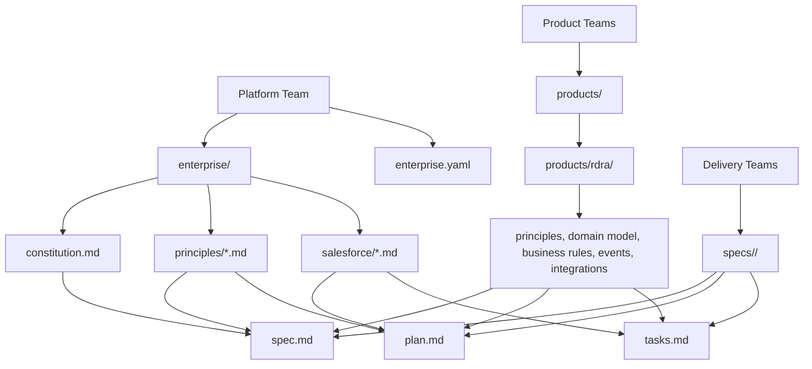

# Enterprise Governance

## Purpose

Enterprise Governance extends Spec-Driven Development with organizational context that delivery teams must consider before producing specifications, plans, and task lists. The current implementation is documentation-first: it provides a governance knowledge base and prompt context without changing Spec Kit command names, workflow execution, CLI behavior, or extension runtime behavior.

The framework is designed around this ownership chain:

```text
Platform Team
  |
  v
Product Teams
  |
  v
Delivery Teams
```

Each layer owns a different type of decision. Platform teams define enterprise standards. Product teams interpret those standards for a business domain. Delivery teams produce feature-level requirements and implementation evidence within those guardrails.

## Ownership Model

### Platform Team

The Platform Team owns enterprise-wide architecture and reusable standards. In this repository, those standards live under `enterprise/` and are indexed by `enterprise.yaml`.

Platform standards are mandatory. Delivery teams should apply them, not redefine them inside a feature spec or implementation plan.

### Product Teams

Product Teams own domain-specific standards, language, product boundaries, product business rules, product events, and product integrations. In the starter structure, RDRA is the sample product under `products/rdra/`.

Product standards are mandatory for features in that product domain. Product teams own the business meaning of concepts, not the enterprise-wide platform architecture.

### Delivery Teams

Delivery Teams own feature requirements and delivery evidence. They are responsible for:

- Capturing feature requirements in `spec.md`.
- Producing implementation decisions in `plan.md`.
- Creating executable work in `tasks.md`.
- Documenting assumptions, risks, and exceptions.
- Proving that delivered work satisfies enterprise and product standards.

Delivery teams should not create competing architecture standards inside feature artifacts. If a feature needs an exception, the exception should be explicit, owned, and reviewable.

## Folder Ownership

| Folder or file | Owner | Purpose | Used by |
| --- | --- | --- | --- |
| `enterprise/constitution.md` | Platform Team | Top-level enterprise decision framework | `/specify`, `/plan`, `/tasks`, future validators |
| `enterprise/principles/` | Platform Team | Security, governance, scalability, compliance, and architecture principles | Feature and architecture review |
| `enterprise/salesforce/` | Salesforce Platform Team | Salesforce-specific Apex, LWC, Flow, testing, and deployment standards | Salesforce planning and task generation |
| `products/` | Product Teams | Product-specific standards, business rules, and domain knowledge | Product feature specs and plans |
| `products/rdra/` | RDRA Product Team | Sample RDRA product governance pack | RDRA feature delivery |
| `enterprise.yaml` | Platform Team | Machine-readable index for future governance automation | Future context loader and validation engine |
| `docs/enterprise-governance.md` | Platform Team | Human-readable operating model | All teams |
| `templates/commands/specify.md` | Spec Kit Core | Prompt instructs agents to consider governance context when present | `/speckit.specify` |
| `templates/commands/plan.md` | Spec Kit Core | Prompt instructs agents to consider governance context when present | `/speckit.plan` |
| `templates/commands/tasks.md` | Spec Kit Core | Prompt instructs agents to consider governance context when present | `/speckit.tasks` |

The prompt-template updates are limited to context instructions. They do not rename commands, alter scripts, or change the Spec Kit workflow.

## Context Precedence

The prompt templates instruct the AI to consider governance context in this order:

```text
Enterprise Constitution
  |
  v
Enterprise Principles
  |
  v
Salesforce Standards
  |
  v
Product Standards
  |
  v
Feature Specification
```

This order matters. A feature may specialize product behavior, but it should not override enterprise rules without a documented exception.

## Architecture Diagram



## Development Lifecycle

```mermaid
flowchart LR
    A[Enterprise standards authored] --> B[Product standards authored]
    B --> C[Delivery team runs /speckit.specify]
    C --> D[spec.md includes governed requirements]
    D --> E[Delivery team runs /speckit.plan]
    E --> F[plan.md applies enterprise and product standards]
    F --> G[Delivery team runs /speckit.tasks]
    G --> H[tasks.md includes implementation and evidence tasks]
    H --> I[Implementation and review]
```



### 1. Enterprise Setup

The Platform Team maintains enterprise standards in `enterprise/` and the machine-readable index in `enterprise.yaml`.

### 2. Product Setup

Each Product Team creates a folder under `products/` and documents product principles, domain model, business rules, integrations, and business events.

## Dynamic Product Context

The active product is selected by `enterprise.yaml`:

```yaml
product:
  name: product-team1
```

or:

```yaml
product:
  name: rdra
```

The Enterprise Context Loader reads `products/<product-name>/` dynamically on each run. Product files include:

- `principles.md`
- `domain-model.md`
- `business-rules.yaml`
- `events.md`
- `integrations.md`
- Future `.md`, `.yaml`, or `.yml` files

If Product Team 1 updates:

```text
products/product-team1/domain-model.md
products/product-team1/events.md
products/product-team1/integrations.md
products/product-team1/business-rules.yaml
```

then future `/speckit-specify`, `/speckit-plan`, and `/speckit-implement` runs use the updated content automatically. The loader does not copy or cache product files; it resolves the product from `enterprise.yaml` and reads the selected folder at runtime.

Enterprise rules remain platform-owned under `enterprise/`. Product business rules remain product-owned under `products/<product-name>/business-rules.yaml`.

### 3. Specification

The Delivery Team runs `/speckit.specify`. The prompt asks the AI to consider enterprise and product standards when shaping user scenarios, requirements, assumptions, and success criteria.

### 4. Planning

The Delivery Team runs `/speckit.plan`. The prompt asks the AI to apply governance context to Technical Context, Constitution Check, research decisions, design artifacts, and exception notes.

### 5. Task Generation

The Delivery Team runs `/speckit.tasks`. The prompt asks the AI to turn applicable governance needs into concrete tasks for implementation, validation, testing, deployment, observability, and evidence.

### 6. Implementation

The Delivery Team implements tasks. Reviewers use enterprise and product docs to check whether the delivered feature stayed inside standards or documented exceptions.

## RDRA Example

Suppose the RDRA team wants a feature that publishes a Salesforce event when a regulated account review is completed.

### Step 1: Product Context

The AI should inspect:

- `products/rdra/principles.md` for RDRA delivery principles.
- `products/rdra/domain-model.md` for business concepts and source-of-record expectations.
- `products/rdra/business-rules.yaml` for product-specific eligibility, validation, and workflow rules.
- `products/rdra/events.md` for event naming, ownership, payload, idempotency, and consumer expectations.
- `products/rdra/integrations.md` for upstream and downstream ownership.

### Step 2: Enterprise Context

The AI should also inspect:

- `enterprise/constitution.md` for mandatory enterprise principles.
- `enterprise/principles/security.md` for data protection and authorization.
- `enterprise/principles/compliance.md` for audit and retention requirements.
- `enterprise/principles/architecture.md` for system ownership and integration contract expectations.
- `enterprise/principles/scalability.md` for throughput and resilience assumptions.

### Step 3: Salesforce Context

Because the feature uses Salesforce events, the AI should inspect:

- `enterprise/salesforce/apex.md` if Apex publishes or processes events.
- `enterprise/salesforce/flow.md` if Flow participates in automation.
- `enterprise/salesforce/testing.md` for permission, bulk, and integration test expectations.
- `enterprise/salesforce/deployment.md` for release sequencing and validation.

### Step 4: Expected Spec Output

The resulting `spec.md` should describe business requirements such as:

- Which RDRA business event occurred.
- Which users or systems need to observe it.
- Which data must be included or excluded.
- Which compliance or audit outcomes are required.
- What success looks like from a business and operational perspective.

The spec should not redefine event architecture or Salesforce platform standards.

### Step 5: Expected Plan Output

The resulting `plan.md` should apply the standards:

- Event producer and owner.
- Consumer contract and versioning approach.
- Salesforce mechanism, such as Platform Event or Change Data Capture, with rationale.
- Security and compliance decisions.
- Error handling, replay, idempotency, and observability.
- Any exception that needs approval.

### Step 6: Expected Tasks Output

The resulting `tasks.md` should include concrete work such as:

- Update RDRA event catalog documentation in `products/rdra/events.md`.
- Add or update contract documentation under the feature's `contracts/` folder.
- Implement publisher logic in the relevant Salesforce artifact path.
- Add bulk, permission, and negative tests.
- Add deployment validation notes.
- Add observability and operational evidence.

## Future Roadmap

### Phase 2: Automatic Context Loader

Goal: automatically discover and load enterprise and product context before command execution.

Expected capabilities:

- Read `enterprise.yaml`.
- Resolve applicable product context from feature metadata or product identifier.
- Provide a normalized context bundle to `/specify`, `/plan`, and `/tasks`.
- Avoid requiring every prompt to rediscover the folder structure manually.

### Phase 3: Enterprise Validation

Goal: validate generated artifacts against mandatory standards.

Expected capabilities:

- Validate `spec.md` against enterprise and product requirements.
- Validate `plan.md` against architecture, Salesforce, security, scalability, and compliance standards.
- Validate `tasks.md` for traceability and evidence tasks.
- Produce advisory or blocking reports through Spec Kit extension hooks.

### Phase 4: Rule Engine

Goal: convert standards into structured rules that can be evaluated consistently.

Expected capabilities:

- Define rules in YAML or a similar structured format.
- Support severity levels such as advisory, warning, and blocking.
- Support exceptions with owners and expiration dates.
- Generate machine-readable validation results.
- Keep human-readable standards and machine-readable rules aligned.

### Phase 5: Knowledge Packs

Goal: package reusable enterprise and product knowledge for installation across repositories.

Expected capabilities:

- Package enterprise standards, Salesforce standards, product templates, and rule sets.
- Version governance knowledge independently.
- Support product-specific packs such as RDRA.
- Allow teams to install approved knowledge packs without copying files by hand.
- Align with Spec Kit presets, extensions, bundles, or a dedicated governance pack mechanism.

## Adoption Guidance

Use the framework in advisory mode first. Stabilize ownership and standards before adding blocking validation. When automation is added, prefer Spec Kit extensions and hooks over direct edits to core behavior.
