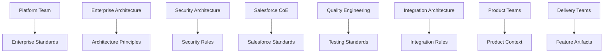
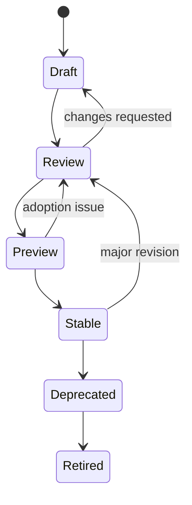
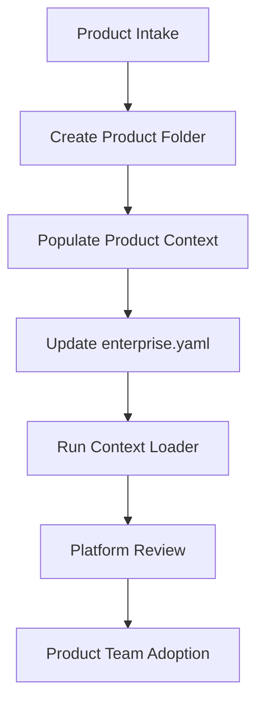
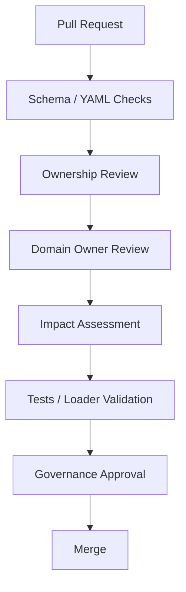
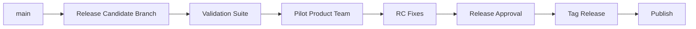
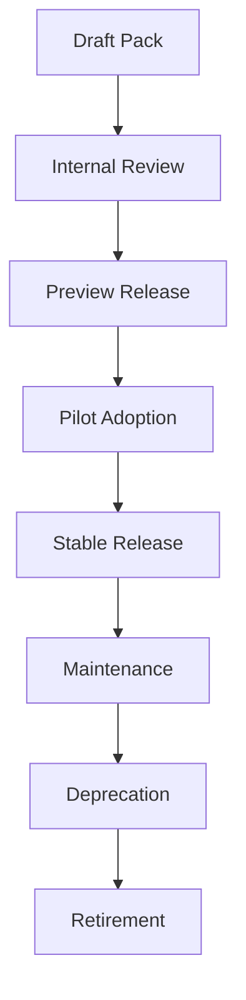

# Enterprise Spec Framework Platform Team Administration Guide

## Purpose

This guide explains how the Platform Team administers the Enterprise Spec Framework (ESF). It is intended for the teams that own enterprise governance, Salesforce platform standards, rule packs, product onboarding, release management, and adoption.

Audience:

- Platform Team
- Enterprise Architects
- Governance Team
- Salesforce Center of Excellence

This guide is suitable for publication in Confluence or GitHub.

## 1. Platform Team Responsibilities

The Platform Team owns the enterprise layer of ESF. Product Teams own product context. Delivery Teams own feature artifacts.

Platform Team responsibilities:

- Maintain the ESF repository structure.
- Own `enterprise/` standards, rules, and knowledge packs.
- Own `enterprise.yaml` schema expectations.
- Maintain bootstrap profiles under `profiles/`.
- Maintain command templates under `templates/commands/`.
- Administer the Enterprise Context Loader.
- Administer the Governance Engine and rule catalog.
- Maintain documentation for Product Teams and Delivery Teams.
- Review Product Team onboarding pull requests.
- Publish ESF releases and release candidates.
- Track adoption, quality metrics, and roadmap decisions.

The Platform Team should not own product-specific business decisions. Those belong to Product Teams.

## 2. ESF Architecture

ESF is a governance layer on top of Spec Kit. It adds enterprise and product context to specification, planning, implementation, and validation workflows.

```mermaid
flowchart TD
    User[Product / Delivery Team] --> Command[Spec Kit Commands]
    Command --> Specify[/speckit-specify]
    Command --> Plan[/speckit-plan]
    Command --> Implement[/speckit-implement]

    EnterpriseYaml[enterprise.yaml] --> Loader[Enterprise Context Loader]
    Enterprise[enterprise/] --> Loader
    Products[products/<product-name>/] --> Loader
    Specs[specs/<feature>/] --> Loader

    Loader --> Context[Context Bundle]
    Context --> Specify
    Context --> Plan
    Context --> Implement
    Context --> Validation[Governance Validation]

    Rules[enterprise/rules/**/*.yaml] --> RuleLoader[Rule Catalog Loader]
    RuleLoader --> Engine[Governance Engine]
    Engine --> Validation
```

Core components:

| Component | Location | Owner | Purpose |
| --- | --- | --- | --- |
| Enterprise config | `enterprise.yaml` | Platform Team | Selects platform and active product context. |
| Enterprise standards | `enterprise/` | Platform Team | Constitution, principles, Salesforce standards, and rules. |
| Product context | `products/<product-name>/` | Product Team | Product principles, domain model, business rules, events, integrations. |
| Context Loader | `src/specify_cli/enterprise_context.py` | Platform Team | Loads enterprise and product context deterministically. |
| Rule Catalog | `enterprise/rules/` | Platform Team | Machine-readable governance rules. |
| Governance Engine | `src/specify_cli/framework/` | Platform Team | Evaluates rule evidence in advisory mode. |
| Bootstrap profile | `profiles/salesforce-enterprise/` | Platform Team | Initializes enterprise-ready projects. |
| Command templates | `templates/commands/` | Platform Team / Spec Kit Core | Instruct AI agents to use governance context. |

## 3. Enterprise Governance Ownership

Governance ownership must be explicit.



Ownership rules:

- `enterprise/` is platform-owned.
- `enterprise/rules/` is platform-owned.
- `enterprise/packs/` is platform-owned.
- `profiles/` is platform-owned.
- `templates/commands/` changes require platform review.
- `products/<product-name>/` is product-owned.
- `specs/<feature>/` is delivery-owned.

## 4. Enterprise Knowledge Pack Management

Knowledge Packs package enterprise-approved standards and rules.

Current pack locations:

```text
enterprise/packs/
|-- salesforce-apex/
|-- salesforce-architecture/
|-- salesforce-flow/
|-- salesforce-integration/
|-- salesforce-security/
`-- salesforce-testing/

enterprise/rules/
|-- salesforce-apex/
|-- salesforce-architecture/
|-- salesforce-flow/
|-- salesforce-integration/
|-- salesforce-security/
`-- salesforce-testing/
```

Each pack should include:

- `README.md`
- `pack.yml`
- Rule folder under `enterprise/rules/<pack-name>/`
- Rule ID prefix
- Owner
- Version
- Release channel
- Compatibility metadata

Example `pack.yml`:

```yaml
name: salesforce-security
title: Enterprise Salesforce Security Knowledge Pack
description: Enterprise-approved Salesforce security governance rules for product teams.
version: "1.0.0"
status: active
owner: Enterprise Salesforce Security Architecture
rule_root: enterprise/rules/salesforce-security
rule_id_prefix: SFSEC
release_channel: preview
minimum_esf_version: "1.0"
```

## 5. Rule Pack Lifecycle

Rule packs move through defined lifecycle states.



Lifecycle states:

| State | Meaning |
| --- | --- |
| `draft` | Initial authoring; not recommended for production use. |
| `review` | Under governance and domain-owner review. |
| `preview` | Published for advisory use; feedback expected. |
| `stable` | Approved enterprise baseline. |
| `deprecated` | Still available but replaced or planned for retirement. |
| `retired` | No longer active; IDs must not be reused. |

## 6. Rule Authoring Standards

Every rule must be clear, testable, and owned.

Required ESF fields:

```yaml
id: SFSEC-001
title: Enforce CRUD Before Object Access
category: Salesforce Security
description: Designs must state how Salesforce object-level permissions are enforced.
rationale: Object permissions are the first authorization boundary for Salesforce data.
severity: blocking
default_enabled: true
applies_to:
  - specification
  - plan
  - apex
keywords:
  - CRUD
  - object permission
recommendation: Check object permissions explicitly or use platform features that enforce CRUD.
references:
  - Salesforce Security Guide
owner: Enterprise Salesforce Security Architecture
version: "1.0.0"
```

Recommended metadata:

```yaml
rule_pack: salesforce-security
domain: Security
topic: CRUD/FLS
required_evidence:
  - Objects touched by the feature are listed.
  - Required object permissions are identified.
negative_evidence:
  - Apex performs DML without checking object permissions.
examples:
  compliant: Service layer checks object permission before update.
  non_compliant: Controller updates records for any user without permission checks.
```

Authoring standards:

- Use stable IDs.
- Use domain-specific prefixes.
- Do not reuse retired IDs.
- Keep descriptions concise.
- Explain why the rule exists.
- Make recommendations actionable.
- Make evidence observable.
- Avoid vague phrases such as "follow best practices" without naming evidence.
- Include official Salesforce or enterprise references.
- Avoid conflicting guidance across packs.

## 7. `business-rules.yaml` Schema

Product Teams own `business-rules.yaml`. Platform Teams own the schema guidance.

Recommended schema:

```yaml
business_rules:
  - id: BR-001
    name: Contact Onboarding Eligibility
    description: Contacts are eligible for onboarding only when required demographic and program data is present.
    applies_to:
      - specification
      - plan
      - implementation
    required_evidence:
      - eligibility criteria
      - required fields
      - validation behavior
    recommendation: Describe eligibility rules before designing automation.
```

Field guidance:

| Field | Required | Owner | Purpose |
| --- | --- | --- | --- |
| `id` | Yes | Product Team | Stable business rule ID. |
| `name` | Yes | Product Team | Human-readable rule name. |
| `description` | Yes | Product Team | Business meaning of the rule. |
| `applies_to` | Yes | Product Team | Artifacts affected by the rule. |
| `required_evidence` | Yes | Product Team | Evidence expected from delivery. |
| `recommendation` | Yes | Product Team | Guidance for applying the rule. |

Platform Team governance:

- Define the schema.
- Provide examples.
- Review Product Team additions for clarity.
- Do not own product-specific rule content unless delegated.

## 8. Rule Versioning

Rules are versioned independently.

Recommended rule versioning:

```text
MAJOR.MINOR.PATCH
```

Examples:

| Change | Version Impact |
| --- | --- |
| Fix typo | Patch |
| Clarify recommendation | Patch |
| Add evidence term | Minor |
| Add advisory rule | Minor |
| Make advisory rule blocking | Major |
| Change rule meaning | Major or new ID |
| Retire rule | Major pack release |

Rule version policy:

- Do not change rule meaning silently.
- Add migration notes when changing severity.
- Prefer new rule IDs for materially different rules.
- Keep deprecated rules visible for at least one major release.

## 9. Knowledge Pack Versioning

Knowledge Packs are versioned as release units.

```text
salesforce-security@1.0.0
salesforce-apex@1.0.0
salesforce-flow@1.0.0
```

Compatibility matrix:

| ESF Version | Pack Version | Status | Notes |
| --- | --- | --- | --- |
| `1.0.x` | `1.0.x` | Supported | Advisory validation and context loading. |
| `1.1.x` | `1.0.x` | Supported | Compatible unless schema changes are introduced. |
| `1.1.x` | `1.1.x` | Preferred | New advisory rules and metadata. |
| `2.0.x` | `1.x` | Compatibility review required | Major engine or schema changes may require migration. |

Pack versioning policy:

- Patch: wording, examples, references.
- Minor: new advisory rules or metadata.
- Major: removed rules, blocking behavior, schema-breaking changes.

## 10. Product Onboarding Process

Product onboarding connects a Product Team to ESF.



Onboarding checklist:

- [ ] Product owner identified.
- [ ] Architecture owner identified.
- [ ] Product folder created.
- [ ] `principles.md` created.
- [ ] `domain-model.md` created.
- [ ] `business-rules.yaml` created.
- [ ] `events.md` created.
- [ ] `integrations.md` created.
- [ ] `enterprise.yaml` updated.
- [ ] Context Loader output verified.
- [ ] Product Team trained.
- [ ] First story walkthrough completed.

## 11. Creating A New Product Team

SOP: Create a new Product Team in ESF.

1. Confirm product identifier.
2. Confirm Product Owner.
3. Confirm Solution Architect.
4. Confirm support owner.
5. Create `products/<product-name>/`.
6. Copy starter product files.
7. Update `enterprise.yaml`.
8. Run context loader.
9. Open pull request.
10. Review with Product Team and Platform Team.

Recommended product identifier:

```text
lowercase-kebab-case
```

Examples:

```text
rdra
customer-onboarding
claims-operations
```

## 12. Creating A New Product Folder

Minimum folder:

```text
products/product-team1/
|-- principles.md
|-- domain-model.md
|-- business-rules.yaml
|-- events.md
`-- integrations.md
```

Example `enterprise.yaml`:

```yaml
product:
  name: product-team1
```

Verification:

```bash
python scripts/load-enterprise-context.py --format list
```

Expected output:

```text
products/product-team1/principles.md
products/product-team1/domain-model.md
products/product-team1/business-rules.yaml
products/product-team1/events.md
products/product-team1/integrations.md
```

## 13. Updating Enterprise Standards

Enterprise standards live under:

```text
enterprise/
|-- constitution.md
|-- principles/
`-- salesforce/
```

SOP: Update enterprise standards.

1. Create issue or decision record if material.
2. Create branch using approved branch naming.
3. Edit the standard.
4. Update related rules if needed.
5. Update docs if behavior changes.
6. Run relevant tests.
7. Open PR.
8. Obtain domain owner approval.
9. Merge after governance approval.

Review checklist:

- [ ] Standard has clear owner.
- [ ] Guidance is actionable.
- [ ] Impacted Product Teams are identified.
- [ ] Rule packs are aligned.
- [ ] Documentation is updated.
- [ ] Migration guidance is included if needed.

## 14. Reviewing Product Team Changes

Product Team changes usually occur under:

```text
products/<product-name>/
```

Platform Team review should focus on:

- Does the folder match `enterprise.yaml`?
- Are product rules business-owned, not platform-owned?
- Are business rules clear and testable?
- Do product rules conflict with enterprise rules?
- Are integrations and events owned?
- Are exceptions documented?

Review stance:

- Do not rewrite product business intent.
- Do challenge ambiguous or untestable rules.
- Do require conflicts with enterprise rules to be explicit.
- Do encourage reusable product terminology.

## 15. Governance Review Workflow



Governance review checklist:

- [ ] Correct owner reviewed.
- [ ] Rule IDs are stable and unique.
- [ ] Rule pack metadata is valid.
- [ ] Product context loads dynamically.
- [ ] No conflicting guidance introduced.
- [ ] Documentation updated.
- [ ] Tests pass.
- [ ] Release notes updated when needed.

## 16. Enterprise Bootstrap Management

The Salesforce enterprise bootstrap profile lives under:

```text
profiles/salesforce-enterprise/
```

It controls what new enterprise projects receive when they run:

```bash
specify init my-project --integration codex --profile salesforce-enterprise
```

The profile is a bootstrap recipe. It includes:

- `enterprise.yaml`
- `products/sample-product/`
- `products/sample-product/business-rules.yaml`
- `docs/esf-onboarding.md`
- `specs/.gitkeep`

Enterprise Governance is copied separately from the repository root `enterprise/` folder into the generated project as a complete snapshot. Do not add duplicate enterprise constitution, rule, standard, or knowledge-pack content under `profiles/salesforce-enterprise/enterprise/`.

SOP: Update bootstrap profile.

1. Update product templates and recipe files under `profiles/salesforce-enterprise/`.
2. Update `docs/project-bootstrap.md`.
3. Update tests in `tests/test_project_bootstrap.py`.
4. Run bootstrap tests.
5. Validate generated project manually if change is material.

SOP: Update Enterprise Governance.

1. Update root files under `enterprise/`.
2. Update or add rule catalog tests when rule structure changes.
3. Run bootstrap tests to verify every root enterprise file is copied.
4. Communicate snapshot impact to Product Teams that initialize new projects.

## 17. Updating Project Templates

Command templates live under:

```text
templates/commands/
|-- specify.md
|-- plan.md
|-- implement.md
|-- tasks.md
`-- ...
```

Template changes affect generated agent instructions.

SOP: Update command template.

1. Identify command and behavior.
2. Edit template.
3. Keep command semantics stable unless intentionally changing behavior.
4. Add or update prompt-template tests.
5. Verify integrations still render expected command files.
6. Update documentation.

Prompt template checklist:

- [ ] Mentions Enterprise Context Loader where required.
- [ ] Mentions dynamic product context.
- [ ] Uses correct command names.
- [ ] Avoids implementation leakage into specification prompts.
- [ ] Preserves hook sections.
- [ ] Preserves completion reporting.

## 18. Context Loader Administration

Context Loader source:

```text
src/specify_cli/enterprise_context.py
```

CLI:

```bash
python scripts/load-enterprise-context.py --format list
python scripts/load-enterprise-context.py --format markdown
python scripts/load-enterprise-context.py --format json
```

Admin responsibilities:

- Maintain deterministic loading order.
- Keep `enterprise.yaml` parsing stable.
- Keep missing-file behavior graceful.
- Avoid product aliases or multi-product loading unless roadmap approves.
- Keep tests current.

Current product loading order:

1. `principles.md`
2. `domain-model.md`
3. `business-rules.yaml`
4. `events.md`
5. `integrations.md`
6. other `.md`, `.yaml`, or `.yml` files alphabetically

Context Loader SOP:

1. Change loader behavior.
2. Add tests for ordering, missing files, and product selection.
3. Run:

```bash
python scripts/load-enterprise-context.py --format list
python -m pytest tests/test_enterprise_context_loader.py -v
```

## 19. Governance Engine Administration

Governance engine components live under:

```text
src/specify_cli/framework/
```

Related CLI:

```bash
python scripts/validate-governance.py --feature specs/001-provider-program --artifact all --format markdown
```

Admin responsibilities:

- Maintain advisory validation behavior.
- Keep rule loading data-driven.
- Avoid hard-coding governance text in Python.
- Preserve report structure.
- Keep errors clear and non-destructive.

Validation modes:

| Mode | Meaning |
| --- | --- |
| Advisory | Produces recommendations; does not block. |
| Warning | Highlights material risk; still non-blocking unless configured otherwise. |
| Blocking | Future capability; requires exception or remediation. |

## 20. Practice Compliance Administration

Practice Compliance is an evidence-oriented matcher for Salesforce practices.

Rule metadata may include:

```yaml
practice:
  type: salesforce_apex_bulkification
  min_confidence: 0.7
required_evidence:
  - processes records in collections
negative_evidence:
  - DML inside loop
evidence_terms:
  processes records in collections:
    - collections
    - bulk records
```

Admin responsibilities:

- Maintain evidence terms.
- Avoid excessive false positives.
- Keep negative evidence precise.
- Review matcher confidence thresholds.
- Keep privacy posture clear.

SOP: Add practice metadata.

1. Add metadata to rule YAML.
2. Add tests for positive evidence.
3. Add tests for missing evidence.
4. Add tests for negative evidence.
5. Run governance engine tests.

## 21. Release Management

ESF releases should include:

- Code changes.
- Rule pack changes.
- Bootstrap changes.
- Documentation updates.
- Migration guidance.
- Test evidence.

Release cadence:

| Release Type | Cadence | Purpose |
| --- | --- | --- |
| Patch | As needed | Fix docs, tests, loader bugs, rule typos. |
| Minor | Monthly or quarterly | Add packs, rules, docs, advisory capabilities. |
| Major | Planned | Breaking schema, enforcement, or workflow changes. |

Release checklist:

- [ ] Version updated.
- [ ] Changelog updated.
- [ ] Rule packs validated.
- [ ] Context Loader validated.
- [ ] Bootstrap tested.
- [ ] Documentation updated.
- [ ] Migration notes written.
- [ ] Release candidate approved.

## 22. Git Branching Strategy

Use the repository branch naming convention:

```text
<type>/<number>-<short-slug>   # issue-backed
<type>/<short-slug>            # PR-only
```

Prefixes:

| Prefix | Use |
| --- | --- |
| `feat/` | New capabilities. |
| `fix/` | Bug fixes. |
| `docs/` | Documentation. |
| `chore/` | Maintenance. |
| `community/` | Community catalog additions. |

Examples:

```text
feat/2342-product-business-rules
docs/platform-admin-guide
fix/context-loader-product-yaml
```

Branch checklist:

- [ ] Prefix is correct.
- [ ] Issue number included when one exists.
- [ ] Slug is short and kebab-case.
- [ ] Branch purpose is clear.

## 23. Pull Request Process

PRs should be small enough to review, but large enough to preserve coherent changes.

PR template:

```markdown
## Summary

- What changed
- Why it changed

## Validation

- [ ] Tests run
- [ ] Context loader checked
- [ ] Rule loader checked
- [ ] Docs reviewed

## Governance Impact

- Enterprise standards changed: yes/no
- Product context changed: yes/no
- Rule packs changed: yes/no
- Bootstrap changed: yes/no

## Migration Notes

- None / details
```

Required reviewers:

| Change Type | Required Review |
| --- | --- |
| Enterprise standards | Enterprise Architecture |
| Security rules | Security Architecture |
| Apex/Flow/LWC standards | Salesforce CoE |
| Testing standards | Quality Engineering |
| Integration rules | Integration Architecture |
| Product context | Product Owner or Product Architect |
| Loader/engine code | Platform Engineering |

Agent disclosure:

- Commits authored by an agent must include an `Assisted-by:` trailer.
- PR comments made by an agent must disclose agent authorship.
- Review-round summary comments must restate agent identity.

## 24. Release Candidate Process



RC checklist:

- [ ] RC branch created.
- [ ] Full test suite run.
- [ ] Rule catalog loads without errors.
- [ ] Context loader loads sample product.
- [ ] Bootstrap creates expected files.
- [ ] Product Team pilot completed.
- [ ] Known issues documented.
- [ ] Release approval recorded.

RC naming:

```text
release/1.2.0-rc1
release/1.2.0-rc2
```

## 25. Knowledge Pack Publishing

Publishing makes a pack available for enterprise adoption.

Knowledge Pack lifecycle:



Publishing checklist:

- [ ] `pack.yml` complete.
- [ ] `README.md` complete.
- [ ] Rules have unique IDs.
- [ ] Rules have owner and version.
- [ ] Rule references are credible.
- [ ] Examples are rule-specific.
- [ ] Tests pass.
- [ ] Release notes updated.
- [ ] Adoption guidance written.

## 26. Enterprise Documentation Standards

Documentation should be clear, durable, and owned.

Documentation standards:

- Use Markdown.
- Use stable headings.
- Include owner and purpose where useful.
- Include examples.
- Include command snippets.
- Include expected outputs.
- Include diagrams for workflows and architecture.
- Avoid unsupported promises.
- Keep docs aligned with tests and actual behavior.

Documentation review checklist:

- [ ] Audience is clear.
- [ ] Purpose is clear.
- [ ] Steps are executable.
- [ ] Examples match current files.
- [ ] Links are valid.
- [ ] Screenshots placeholders are intentional.
- [ ] Mermaid diagrams render.

## 27. Metrics And Adoption Strategy

Platform Teams should measure adoption and friction.

Adoption metrics:

- Number of Product Teams onboarded.
- Number of active product folders.
- Number of generated specs.
- Number of generated plans.
- Number of governance validations run.
- Number of rule packs adopted.
- Number of exceptions requested.
- Number of recurring findings.

Quality metrics:

- Spec rework rate.
- Plan review findings.
- Security findings by category.
- Testing evidence gaps.
- Governance validation trend.
- Release defect leakage.

Adoption strategy:

1. Start advisory.
2. Pilot with one Product Team.
3. Capture friction.
4. Improve docs and templates.
5. Expand to more teams.
6. Introduce stronger gates only after rules are trusted.

## 28. Disaster Recovery

ESF disaster recovery is mostly repository and process recovery.

Risks:

- Corrupt `enterprise.yaml`.
- Broken Context Loader.
- Invalid YAML rule files.
- Incorrect bootstrap profile.
- Accidental deletion of product context.
- Bad rule pack release.

Recovery SOP:

1. Stop publishing affected release.
2. Identify last known good commit or tag.
3. Restore affected files from git history.
4. Run loader and tests.
5. Notify affected Product Teams.
6. Publish patch release if needed.
7. Document root cause and prevention.

Critical validation commands:

```bash
python scripts/load-enterprise-context.py --format list
python scripts/load-rules.py --list
python -m pytest tests/test_enterprise_context_loader.py tests/test_rule_catalog.py -v
```

Backup expectations:

- Git is the source of truth.
- Product Team changes should be reviewed through PRs.
- Release tags should be immutable.
- Generated feature artifacts should remain in repository history when required by governance.

## 29. Upgrade Strategy

Upgrade types:

| Upgrade Type | Example | Required Action |
| --- | --- | --- |
| Documentation-only | New guide | Review and publish. |
| Rule-only | New advisory rules | Validate rule catalog and notify teams. |
| Bootstrap | New product template file | Test `specify init --profile`. |
| Loader | New context ordering | Run loader tests and migration docs. |
| Engine | Matcher behavior change | Run governance engine tests and pilot. |
| Breaking | Schema or enforcement change | Release candidate and migration plan. |

Upgrade SOP:

1. Read release notes.
2. Identify impacted Product Teams.
3. Run compatibility tests.
4. Pilot with one product.
5. Update docs.
6. Publish migration guidance.
7. Roll out broadly.

Migration checklist:

- [ ] Existing product folders still load.
- [ ] Existing rules still parse.
- [ ] Existing command templates render.
- [ ] Existing feature folders remain valid.
- [ ] Product Teams understand required changes.

## 30. Roadmap Management

Roadmap ownership belongs to the Platform Team with Enterprise Architecture input.

Roadmap categories:

- Context loading.
- Product governance.
- Rule catalog.
- Governance engine.
- Practice compliance.
- Knowledge packs.
- Bootstrap profiles.
- Documentation.
- Adoption and metrics.

Roadmap intake template:

```markdown
## Proposal

What capability is requested?

## Business Value

Who benefits and how?

## Scope

What is included?

## Non-Goals

What is explicitly excluded?

## Risks

What could go wrong?

## Acceptance Criteria

- [ ] Criterion 1
- [ ] Criterion 2
```

Roadmap governance:

- Review quarterly.
- Prioritize adoption blockers.
- Avoid premature blocking validation.
- Keep ESF behavior explainable.
- Prefer data-driven rules over hard-coded logic.

## Appendix A: SOP Index

### SOP: Add A New Enterprise Rule

1. Select rule pack and ID prefix.
2. Create rule YAML.
3. Add required fields.
4. Add metadata, evidence, and examples.
5. Validate with `python scripts/load-rules.py --list`.
6. Run rule catalog tests.
7. Open PR with domain owner review.

### SOP: Add A New Knowledge Pack

1. Create `enterprise/packs/<pack-name>/`.
2. Add `README.md`.
3. Add `pack.yml`.
4. Create `enterprise/rules/<pack-name>/`.
5. Add rules.
6. Validate rule catalog.
7. Update docs.
8. Publish as preview.

### SOP: Onboard A Product Team

1. Create product folder.
2. Add product knowledge files.
3. Update `enterprise.yaml`.
4. Run context loader.
5. Review with Product Team.
6. Complete first story walkthrough.

### SOP: Publish A Release

1. Create release candidate.
2. Run tests.
3. Validate sample bootstrap.
4. Validate rule packs.
5. Update changelog and release notes.
6. Obtain approval.
7. Tag release.
8. Publish.

## Appendix B: Templates

### Rule Template

```yaml
id: SFDOMAIN-001
title: Short Rule Title
category: Salesforce Domain
description: What the rule requires.
rationale: Why the rule exists.
severity: advisory
default_enabled: true
applies_to:
  - specification
  - plan
keywords:
  - keyword
recommendation: What the team should do.
references:
  - Salesforce Documentation
owner: Owning Team
version: "1.0.0"
rule_pack: pack-name
domain: Domain
topic: Topic
required_evidence:
  - Evidence item
negative_evidence:
  - Anti-pattern
examples:
  compliant: Compliant example.
  non_compliant: Non-compliant example.
```

### Product Folder Template

```text
products/<product-name>/
|-- principles.md
|-- domain-model.md
|-- business-rules.yaml
|-- events.md
`-- integrations.md
```

### Exception Template

```markdown
## Exception

Rule or standard:

Reason:

Risk:

Compensating controls:

Owner:

Expiration date:

Approval:
```

### Release Notes Template

```markdown
# ESF Release X.Y.Z

## Summary

## New Capabilities

## Rule Pack Changes

## Bootstrap Changes

## Documentation Changes

## Migration Guidance

## Known Issues
```

## Appendix C: Administrative Command Reference

```bash
python scripts/load-enterprise-context.py --format list
python scripts/load-enterprise-context.py --format markdown
python scripts/load-enterprise-context.py --format json
python scripts/load-rules.py --list
python scripts/load-rules.py --category salesforce-security
python scripts/validate-governance.py --feature specs/001-provider-program --artifact all --format markdown
python -m pytest tests/test_enterprise_context_loader.py -v
python -m pytest tests/test_rule_catalog.py -v
python -m pytest tests/test_governance_engine.py -v
```

## Appendix D: Platform Team Operating Principles

1. Keep governance explainable.
2. Prefer advisory adoption before blocking enforcement.
3. Keep product ownership with Product Teams.
4. Keep enterprise standards reusable and product-neutral.
5. Favor structured YAML for machine-readable rules.
6. Keep prompt templates aligned with actual loader behavior.
7. Treat documentation as part of the product.
8. Validate every governance change with tests.
