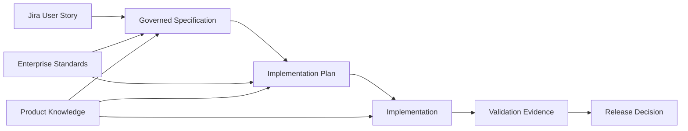
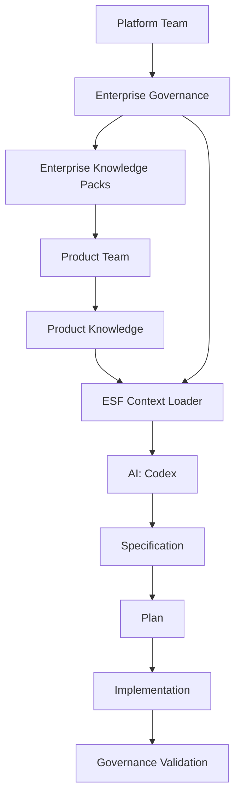
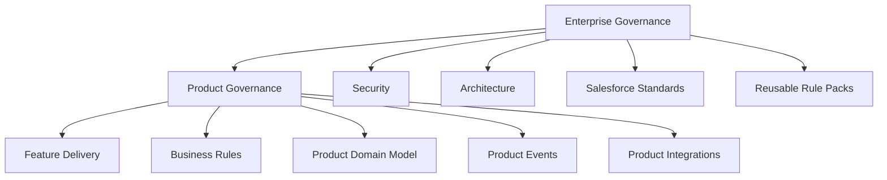
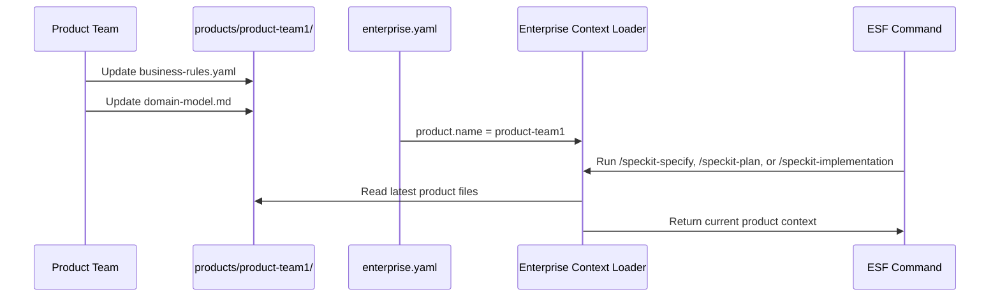

# Enterprise Spec Framework (ESF)

# Product Team User Guide

Official onboarding guide for Salesforce Product Teams using the Enterprise Spec Framework.

## 1. Introduction

The Enterprise Spec Framework (ESF) is the enterprise governance layer for Spec Kit. It helps Product Teams turn business intent into governed specifications, implementation plans, implementation work, and review evidence.

This guide is written for:

- Product Owners
- Business Analysts
- Solution Architects
- Salesforce Developers
- QA Engineers
- Technical Leads

It is written for people who have never used ESF before. It explains what ESF is, why the organization uses it, how Product Teams benefit from it, and how to use it from project installation through delivery of a Jira User Story.

ESF was created because large Salesforce delivery organizations need both speed and consistency. With one Enterprise Platform Team and many Product Teams, governance cannot depend on every team remembering every standard manually. ESF brings enterprise standards, product knowledge, and AI-assisted delivery into one repeatable workflow.

The practical benefits for Product Teams are:

- Clearer specifications before implementation starts.
- Product rules applied consistently across stories.
- Enterprise Salesforce, security, architecture, and testing standards available during planning.
- Better traceability from Jira story to specification, plan, implementation, and governance evidence.
- Fewer late governance surprises.
- Faster onboarding for new team members.

> Screenshot placeholder: ESF repository home page with `enterprise/`, `products/`, `specs/`, and `enterprise.yaml` visible.

## 2. Why ESF Exists

Enterprise Salesforce delivery often fails for predictable reasons:

- Teams start implementation before business rules are clear.
- Product-specific vocabulary is scattered across tickets, chats, and old designs.
- Enterprise architecture, security, testing, and integration standards are applied late.
- Feature plans do not trace back to product domain rules.
- Delivery teams repeat the same decisions across stories.
- Governance review becomes a manual afterthought.

ESF exists to make governance usable during everyday delivery. It gives teams a structured way to keep enterprise standards, product context, and feature work connected.



ESF does not replace Product Ownership, architecture judgment, QA strategy, or engineering discipline. It gives those roles a shared framework and repeatable context.

## 3. Roles And Responsibilities

At a glance:

| Role | Primary ESF Responsibility | Key Files Or Artifacts |
| --- | --- | --- |
| Platform Team | Own enterprise governance, standards, bootstrap recipes, and rule packs. | Root `enterprise/`, profiles, command templates, validation scripts |
| Product Owner | Own business outcome, story priority, and acceptance of product intent. | Jira story, acceptance criteria, product principles |
| Business Analyst | Maintain business language, rules, process details, and edge cases. | `business-rules.yaml`, `principles.md`, `spec.md` |
| Solution Architect | Shape the Salesforce solution within enterprise guardrails. | `domain-model.md`, `integrations.md`, `plan.md` |
| Technical Lead | Coordinate implementation approach, code quality, and developer readiness. | `tasks.md`, implementation evidence, pull request |
| Salesforce Developer | Implement governed changes and tests. | Apex, Flow, LWC, metadata, test classes |
| QA Engineer | Validate acceptance criteria, test coverage, and governance evidence. | Test cases, validation report, release evidence |

### Product Owner

The Product Owner owns business value and priority.

Responsibilities:

- Keep product goals and business outcomes clear.
- Confirm Jira User Story intent.
- Approve product business rules and acceptance criteria.
- Review scope tradeoffs and exception impacts.
- Decide whether a feature is ready for delivery.

### Business Analyst

The Business Analyst translates product intent into precise business requirements.

Responsibilities:

- Maintain product terminology and process rules.
- Update `business-rules.yaml` when product rules change.
- Clarify user personas, data needs, edge cases, and acceptance scenarios.
- Review `/speckit-specify` output for business accuracy.

### Solution Architect

The Solution Architect owns solution shape within enterprise guardrails.

Responsibilities:

- Maintain product domain model and integration context.
- Review technical approach generated by `/speckit-plan`.
- Identify architecture exceptions and compensating controls.
- Ensure Salesforce design aligns with enterprise standards.

### Salesforce Developer

The Salesforce Developer owns implementation quality.

Responsibilities:

- Use ESF context before coding.
- Implement according to the approved plan.
- Add Apex, Flow, LWC, integration, and metadata changes as needed.
- Create unit, bulk, security, and integration tests.
- Preserve traceability from story to implementation evidence.

### QA Engineer

The QA Engineer owns test strategy and quality evidence.

Responsibilities:

- Review acceptance criteria and testability.
- Ensure negative, bulk, permission, and integration scenarios are covered.
- Validate governance findings are addressed or accepted.
- Confirm release-readiness evidence.

### Technical Lead

The Technical Lead coordinates implementation execution across developers.

Responsibilities:

- Confirm `tasks.md` is coherent before implementation starts.
- Coordinate code ownership and sequencing.
- Ensure developers follow the approved plan.
- Review implementation evidence before Pull Request.
- Help resolve technical findings from governance validation.

### Platform Team

The Platform Team owns enterprise standards.

Responsibilities:

- Maintain `enterprise/`.
- Maintain enterprise rule packs.
- Review exception requests.
- Keep ESF bootstrap recipes, templates, and governance guidance current.

### Product Team

The Product Team owns product knowledge.

Responsibilities:

- Maintain `products/<product-name>/`.
- Keep product files current.
- Ensure product-specific business rules are explicit.
- Review generated specifications and plans against product intent.

## 4. ESF Architecture Overview

ESF is built around layered governance context.



The Platform Team owns enterprise governance and standards in the root `enterprise/` folder. Product Teams own product knowledge under `products/<product-name>/`. The Context Loader combines both at runtime so Codex can generate governed delivery artifacts.

```mermaid
flowchart TD
    A[enterprise.yaml] --> B[Enterprise Context Loader]
    B --> C[Enterprise Constitution]
    B --> D[Enterprise Principles]
    B --> E[Salesforce Standards]
    B --> F[Selected Product Folder]
    F --> G[principles.md]
    F --> H[domain-model.md]
    F --> I[business-rules.yaml]
    F --> J[events.md]
    F --> K[integrations.md]
    B --> L[Context Bundle]
    L --> M[/speckit-specify]
    L --> N[/speckit-plan]
    L --> O[/speckit-implementation]
    L --> P[validate-governance]
```

The most important idea: ESF loads product context dynamically from the product selected in `enterprise.yaml`.

```yaml
product:
  name: rdra
```

This tells ESF to load:

```text
products/rdra/principles.md
products/rdra/domain-model.md
products/rdra/business-rules.yaml
products/rdra/events.md
products/rdra/integrations.md
```

If the Product Team edits those files, the next ESF command run uses the updated content.

Bootstrap profile folders are not runtime governance sources. The Salesforce Enterprise profile is a recipe that creates starter project files and product templates. Enterprise Governance is copied from the Platform Team's root `enterprise/` folder into the generated project as a complete snapshot.

## 5. Folder Structure Explanation

A Salesforce enterprise project initialized with ESF typically looks like this:

```text
my-project/
|-- .specify/
|   |-- memory/
|   |   `-- constitution.md
|   `-- feature.json
|-- enterprise/
|   |-- constitution.md
|   |-- principles/
|   |   |-- architecture.md
|   |   |-- compliance.md
|   |   |-- governance.md
|   |   |-- scalability.md
|   |   `-- security.md
|   |-- salesforce/
|   |   |-- apex.md
|   |   |-- deployment.md
|   |   |-- flow.md
|   |   |-- lwc.md
|   |   |-- testing.md
|   |   `-- ...
|   `-- rules/
|       |-- security/
|       |-- apex/
|       |-- flow/
|       `-- testing/
|-- products/
|   `-- rdra/
|       |-- principles.md
|       |-- domain-model.md
|       |-- business-rules.yaml
|       |-- events.md
|       `-- integrations.md
|-- specs/
|   `-- 001-contact-onboarding/
|       |-- spec.md
|       |-- plan.md
|       |-- tasks.md
|       |-- research.md
|       |-- data-model.md
|       |-- contracts/
|       `-- checklists/
|-- docs/
|-- enterprise.yaml
`-- README.md
```

### Key Folders

| Folder | Owner | Purpose |
| --- | --- | --- |
| `enterprise/` | Platform Team | Enterprise-wide standards, Salesforce standards, and rule packs. |
| `products/` | Product Teams | Product-specific principles, domain model, business rules, events, and integrations. |
| `specs/` | Delivery Teams | Generated feature specifications, plans, tasks, and evidence. |
| `.specify/` | Spec Kit / ESF | Runtime memory, feature tracking, and workflow support. |
| `docs/` | Shared | Human-readable documentation. |

`enterprise/` in a generated project is a point-in-time snapshot from the Platform Team's root Enterprise Governance source. Product Teams should not edit enterprise rules to solve one product issue unless the Platform Team approves the change or grants an exception.

`profiles/salesforce-enterprise/` is template-time only. It provides `enterprise.yaml`, onboarding docs, `specs/` scaffolding, and the starter `products/sample-product/` template. It does not own duplicate enterprise standards or sample enterprise rules.

## 6. Enterprise Governance Vs Product Governance

Enterprise governance and product governance are different layers.



### Enterprise Governance

Enterprise governance answers:

- What standards apply to all teams?
- What Salesforce patterns are approved?
- What security, compliance, testing, and architecture evidence is required?
- What needs exception approval?

Enterprise governance is loaded from runtime project files under:

```text
enterprise/constitution.md
enterprise/principles/*.md
enterprise/salesforce/**/*.md
```

The enterprise constitution is the top-level decision framework for interpreting enterprise principles and Salesforce standards. It complements `.specify/memory/constitution.md`; it does not replace the core Spec Kit project constitution.

Examples:

- Apex must be bulk-safe.
- CRUD/FLS must be considered.
- Integrations must use Named Credentials.
- Critical automation must have fault handling.

### Product Governance

Product governance answers:

- What does this product mean by a business concept?
- What business rules apply to this product?
- Which events does this product publish or consume?
- Which integrations belong to this product?
- What product-specific constraints must every story respect?

Examples:

- A Contact is eligible for onboarding only when required demographic and program data exists.
- A review is complete only after approval and audit evidence are present.
- A Product Team owns a specific event contract.

## 7. Product Knowledge Files

Each product folder should contain these core files:

```text
products/<product-name>/
|-- principles.md
|-- domain-model.md
|-- business-rules.yaml
|-- events.md
`-- integrations.md
```

### `principles.md`

Use this file for product-specific principles.

Example topics:

- Product mission.
- Product delivery priorities.
- Product ownership boundaries.
- Product-specific non-negotiables.

### `domain-model.md`

Use this file for business entities and relationships.

Example topics:

- Product-owned entities.
- Source-of-record expectations.
- Data definitions.
- State transitions.
- Ownership boundaries.

### `business-rules.yaml`

Use this file for structured product business rules.

Example topics:

- Eligibility rules.
- Validation rules.
- Completion rules.
- Product-specific decision rules.
- Required evidence.

### `events.md`

Use this file for product event definitions.

Example topics:

- Event names.
- Producers and consumers.
- Payload ownership.
- Idempotency expectations.
- Replay and versioning guidance.

### `integrations.md`

Use this file for product integration context.

Example topics:

- Upstream systems.
- Downstream systems.
- Middleware ownership.
- API contracts.
- Data synchronization rules.

## 8. `business-rules.yaml` Purpose And Examples

`business-rules.yaml` is the structured business rule file owned by the Product Team.

It helps ESF and AI agents understand product-specific rules before generating specifications, plans, and implementation work.

### Starter Example

```yaml
business_rules:
  - id: BR-001
    name: Contact Onboarding Eligibility
    description: Contacts are eligible for onboarding only when required demographic and program data is present.
    applies_to:
      - specification
      - plan
      - implementation
    required_evidence:
      - eligibility criteria
      - required fields
      - validation behavior
    recommendation: Describe eligibility rules before designing automation.
```

### Expanded Example

```yaml
business_rules:
  - id: BR-001
    name: Contact Onboarding Eligibility
    description: Contacts are eligible for onboarding only when required demographic and program data is present.
    applies_to:
      - specification
      - plan
      - implementation
    required_evidence:
      - eligibility criteria
      - required fields
      - validation behavior
    recommendation: Describe eligibility rules before designing automation.

  - id: BR-002
    name: Regulated Account Review Completion
    description: Regulated account reviews are complete only when required approvals, audit evidence, and disposition fields are present.
    applies_to:
      - specification
      - plan
      - implementation
    required_evidence:
      - approval criteria
      - audit evidence
      - completion status behavior
    recommendation: Define review completion rules before publishing events or updating account status.
```

### Recommended Fields

| Field | Purpose |
| --- | --- |
| `id` | Stable business rule identifier, such as `BR-001`. |
| `name` | Human-readable rule name. |
| `description` | What the rule means. |
| `applies_to` | Delivery artifacts where the rule should be considered. |
| `required_evidence` | Evidence the team should provide. |
| `recommendation` | Guidance for applying the rule. |

### Good Business Rule Characteristics

Good rules are:

- Business-owned.
- Stable enough to reuse across stories.
- Specific enough to test.
- Written in business language.
- Traceable to acceptance criteria or implementation evidence.

Avoid rules that are:

- Pure implementation instructions.
- Too vague to test.
- Duplicated from enterprise standards.
- Temporary story notes that belong only in Jira.

## 9. Dynamic Product Context Using `enterprise.yaml`

`enterprise.yaml` selects the active product.

```yaml
product:
  name: rdra
```

With this setting, ESF loads:

```text
products/rdra/principles.md
products/rdra/domain-model.md
products/rdra/business-rules.yaml
products/rdra/events.md
products/rdra/integrations.md
```

If the product changes:

```yaml
product:
  name: product-team1
```

ESF loads:

```text
products/product-team1/principles.md
products/product-team1/domain-model.md
products/product-team1/business-rules.yaml
products/product-team1/events.md
products/product-team1/integrations.md
```

### Dynamic Loading Behavior



Product Team changes are picked up on the next command run. There is no remote sync, database, UI, or cache.

## 10. End-To-End Jira User Story Lifecycle

The ESF lifecycle starts with a Jira User Story and ends with implementation evidence.

```mermaid
flowchart TD
    A[Jira User Story Created] --> B[Product Context Updated]
    B --> C[/speckit-specify]
    C --> D[spec.md]
    D --> E[validate-governance]
    E --> F[/speckit-plan]
    F --> G[plan.md + design artifacts]
    G --> H[validate-governance]
    H --> I[/speckit-tasks]
    I --> J[tasks.md]
    J --> K[/speckit-implementation]
    K --> L[Code + Tests + Metadata]
    L --> M[validate-governance]
    M --> N[Review + Release]
```

### Lifecycle Steps

1. Product Owner creates or refines the Jira User Story.
2. Team opens VS Code and navigates to the ESF project.
3. Team pulls the latest repository changes.
4. Business Analyst and Architect update Product Knowledge if required.
5. Delivery Team runs `/speckit-specify`.
6. Team reviews generated `spec.md`.
7. Team runs `/speckit-plan`.
8. Solution Architect reviews plan, risks, and exceptions.
9. Team runs `/speckit-implementation` or the equivalent implementation command installed for the Codex integration.
10. Developers complete implementation tasks and update evidence.
11. Team runs governance validation.
12. Team addresses findings or documents approved exceptions.
13. Team commits changes and creates a Pull Request.

> Screenshot placeholder: Jira User Story linked to generated `spec.md`, `plan.md`, and `tasks.md`.

## 11. Installation

### Prerequisites

Typical prerequisites:

- Python and `uv`, or another supported Spec Kit installation method.
- Git.
- Access to the repository.
- Your chosen AI coding agent integration.

Install the ESF-enabled Specify CLI:

```bash
uv tool install --force --from git+https://github.com/salesforceseeker41-sys/spec-kit.git
```

Expected output:

```text
Installed 1 executable: specify
```

For framework contributors working inside this repository, install local dependencies:

```bash
uv sync --extra test
```

Verify the CLI:

```bash
.venv/Scripts/python -m specify_cli --help
```

On Unix-like systems:

```bash
.venv/bin/python -m specify_cli --help
```

Expected output includes available `specify` commands such as `init`.

## 12. Project Bootstrap

Create a new ESF-ready Salesforce project:

```bash
specify init my-project --integration codex --profile salesforce-enterprise
```

The `salesforce-enterprise` profile is a bootstrap recipe. During initialization, the CLI copies product starter templates from the profile and copies the complete Enterprise Governance snapshot from the Platform Team-owned root `enterprise/` folder.

Expected generated structure:

```text
my-project/
|-- enterprise/
|-- products/
|   `-- sample-product/
|       |-- principles.md
|       |-- domain-model.md
|       |-- business-rules.yaml
|       |-- events.md
|       `-- integrations.md
|-- specs/
|-- docs/
`-- enterprise.yaml
```

Bootstrap source and runtime source are different:

| Phase | Source | Purpose |
| --- | --- | --- |
| Template-time | `profiles/salesforce-enterprise/` | Starter product template, onboarding docs, `enterprise.yaml`, empty scaffolding. |
| Template-time | root `enterprise/` | Authoritative Enterprise Governance copied into the new project. |
| Runtime | generated `enterprise/` | Enterprise constitution, principles, Salesforce standards, rules, and packs used by commands. |
| Runtime | `products/<product-name>/` | Product principles, domain model, business rules, events, and integrations selected by `enterprise.yaml`. |

After bootstrap:

1. Rename `products/sample-product/` to your product name.
2. Update `enterprise.yaml`.
3. Populate product knowledge files.
4. Run the normal Spec Kit workflow.

Example:

```yaml
product:
  name: rdra
```

The next ESF command reads `products/rdra/` dynamically. No reinstall is required after Product Team file edits.

> Screenshot placeholder: Initialized ESF project folder in VS Code Explorer.

## 13. Daily Workflow

Use this daily rhythm for Jira User Story delivery.


### Daily Checklist

- Check whether the Jira story depends on new product business rules.
- Update `business-rules.yaml` before generating the spec.
- Update `domain-model.md` if entities or relationships changed.
- Update `events.md` if event behavior changed.
- Update `integrations.md` if system boundaries changed.
- Run `/speckit-specify`.
- Review the generated specification with Product Owner and BA.
- Run `/speckit-plan`.
- Review architecture, security, testing, and integration impacts.
- Run `/speckit-implementation`.
- Run governance validation before Pull Request.
- Address findings or document exceptions before requesting review.

## 14. Commands

### `specify init`

Creates a Spec Kit project. With the Salesforce enterprise profile, it also creates ESF folders.

```bash
specify init my-project --integration codex --profile salesforce-enterprise
```

Expected output:

```text
Project initialized
Enterprise Salesforce scaffold installed
Next steps: run /speckit-specify
```

### `/speckit-specify`

Creates or updates the feature specification.

Example:

```text
/speckit-specify Create a Salesforce onboarding workflow that validates Contact eligibility before creating onboarding tasks.
```

Expected outputs:

```text
specs/001-contact-onboarding/spec.md
specs/001-contact-onboarding/checklists/requirements.md
.specify/feature.json
```

What ESF adds:

- Loads enterprise governance context.
- Loads selected product context from `enterprise.yaml`.
- Applies `business-rules.yaml` to requirements.
- Keeps specification focused on what users need and why.

### `/speckit-plan`

Creates the implementation plan and design artifacts.

Example:

```text
/speckit-plan Use Salesforce Flow for simple eligibility checks and Apex only where reusable validation logic is required.
```

Expected outputs:

```text
specs/001-contact-onboarding/plan.md
specs/001-contact-onboarding/research.md
specs/001-contact-onboarding/data-model.md
specs/001-contact-onboarding/contracts/
specs/001-contact-onboarding/quickstart.md
```

What ESF adds:

- Applies enterprise Salesforce standards.
- Applies selected product rules and domain model.
- Surfaces architecture, security, testing, and integration concerns.
- Identifies exceptions instead of silently bypassing standards.

### `/speckit-implementation`

Executes implementation tasks from `tasks.md`.

Some environments expose the command as `/speckit-implement` or `/speckit.implement`. Use `/speckit-implementation` when that command is installed for your ESF Codex integration, or use the equivalent implementation workflow configured by the Platform Team.

Example:

```text
/speckit-implementation
```

Expected behavior:

- Reads `tasks.md`.
- Reads `plan.md`.
- Reads feature artifacts such as `data-model.md`, `research.md`, and `contracts/`.
- Uses Enterprise Context Loader for enterprise and product constraints.
- Implements tasks in order.
- Marks completed tasks.

### `validate-governance`

Runs advisory governance validation.

Examples:

```bash
python scripts/validate-governance.py --matcher practice
python scripts/validate-governance.py --feature specs/001-contact-onboarding --artifact spec
python scripts/validate-governance.py --feature specs/001-contact-onboarding --artifact plan
python scripts/validate-governance.py --feature specs/001-contact-onboarding --artifact all --format markdown
python scripts/validate-governance.py --feature specs/001-contact-onboarding --artifact all --write-report
```

Expected output:

```text
Governance Review
- Findings grouped by category
- Advisory recommendations
- Missing evidence
- Suggested remediation
```

Validation is advisory unless your organization separately enables blocking gates.

## 15. Example Salesforce Story Walkthrough

### Jira Story

```text
As a Program Coordinator,
I want Salesforce to validate Contact onboarding eligibility,
so that onboarding tasks are created only for Contacts with complete demographic and program data.
```

### Step 1: Update Product Business Rule

`products/rdra/business-rules.yaml`:

```yaml
business_rules:
  - id: BR-001
    name: Contact Onboarding Eligibility
    description: Contacts are eligible for onboarding only when required demographic and program data is present.
    applies_to:
      - specification
      - plan
      - implementation
    required_evidence:
      - eligibility criteria
      - required fields
      - validation behavior
    recommendation: Describe eligibility rules before designing automation.
```

### Step 2: Generate Specification

```text
/speckit-specify Create a Salesforce onboarding workflow that validates Contact eligibility before creating onboarding tasks.
```

Expected `spec.md` should include:

- Eligible Contact definition.
- Required demographic data.
- Required program data.
- Behavior when data is missing.
- User-facing outcome.
- Acceptance scenarios.

### Step 3: Generate Plan

```text
/speckit-plan Use Salesforce Flow for the user-facing onboarding path and Apex only for reusable eligibility validation if needed.
```

Expected `plan.md` should include:

- Flow type.
- Apex or Flow decision.
- CRUD/FLS approach.
- Bulk behavior.
- Error handling.
- Test strategy.
- Deployment and rollback.

### Step 4: Validate Governance

```bash
python scripts/validate-governance.py --feature specs/001-contact-onboarding --artifact all --format markdown
```

Example finding:

```text
Category: Testing
Finding: Bulk test evidence is missing.
Recommendation: Add tests for multiple Contacts with mixed eligibility states.
Severity: advisory
```

### Step 5: Implement

```text
/speckit-implementation
```

Expected implementation evidence:

- Flow or Apex changes.
- Tests for eligible and ineligible Contacts.
- Bulk test data.
- Security behavior.
- Error path validation.

> Screenshot placeholder: Generated feature folder with `spec.md`, `plan.md`, `tasks.md`, and validation report.

## 16. Governance Validation Interpretation

Governance validation findings are decision support.

### Finding Anatomy

```text
Rule: SEC-001 CRUD/FLS Enforcement
Artifact: plan
Severity: advisory
Message: Plan does not describe CRUD/FLS enforcement.
Recommendation: Document object and field permission enforcement for Contact and Onboarding Task.
```

### How To Interpret Severity

| Severity | Meaning | Product Team Action |
| --- | --- | --- |
| `advisory` | Recommended evidence is missing or weak. | Review and improve if relevant. |
| `warning` | Risk is material and should be addressed or accepted. | Add evidence or document exception. |
| `blocking` | Should not proceed without evidence or approved exception. | Stop, fix, or obtain approval. |

### Good Response

```text
Added CRUD/FLS section to plan.md covering Contact and Onboarding_Task__c.
Added negative permission test task to tasks.md.
No exception required.
```

### Poor Response

```text
Ignored. Developers know this already.
```

The goal is not to satisfy the tool. The goal is to create enough evidence that reviewers, testers, and future maintainers can understand the decision.

## 17. Best Practices

### Keep Product Files Current

Update product files before generating new artifacts.

Good:

```text
Update business-rules.yaml, then run /speckit-specify.
```

Risky:

```text
Generate spec first, then remember product rules later.
```

### Write Business Rules In Business Language

Good:

```text
Contacts are eligible for onboarding only when demographic and program data is complete.
```

Weak:

```text
Flow should check fields before insert.
```

### Treat Generated Output As Drafts

AI-generated specs and plans are drafts. Product Teams still review them.

Review for:

- Product truth.
- Missing edge cases.
- Incorrect terminology.
- Overly technical requirements.
- Missing acceptance evidence.

### Keep Exceptions Explicit

If a standard cannot be met, document:

- Standard being waived.
- Reason.
- Risk.
- Compensating controls.
- Owner.
- Expiration date.

### Use Governance Findings As Coaching

Findings should start useful conversations:

- Did we miss evidence?
- Is the rule applicable?
- Do we need an exception?
- Should product knowledge be updated?

## 18. Common Mistakes

### Mistake: Product Folder Does Not Match `enterprise.yaml`

Problem:

```yaml
product:
  name: rdra
```

But the folder is:

```text
products/RDRA/
```

Fix:

```text
products/rdra/
```

or update `enterprise.yaml`.

### Mistake: Business Rules Hidden In Jira Comments

If a business rule applies across stories, put it in `business-rules.yaml`.

### Mistake: Treating Enterprise Rules As Product-Owned

Product Teams own product rules. Platform Teams own enterprise rules.

Do not edit `enterprise/rules/` to solve a single product issue unless the Platform Team agrees.

### Mistake: Skipping Plan Review

`/speckit-plan` output must be reviewed by Solution Architects and Developers. It is not automatically correct.

### Mistake: Ignoring Missing Evidence

If validation says evidence is missing, either add evidence or explain why the rule does not apply.

### Mistake: Updating Product Files After Implementation

The most useful product context is written before specification and planning.

## 19. Troubleshooting

### Product Context Is Not Loading

Check `enterprise.yaml`:

```yaml
product:
  name: rdra
context:
  loadProduct: true
```

Check folder exists:

```text
products/rdra/
```

Run:

```bash
python scripts/load-enterprise-context.py --format list
```

Expected:

```text
products/rdra/principles.md
products/rdra/domain-model.md
products/rdra/business-rules.yaml
products/rdra/events.md
products/rdra/integrations.md
```

### `business-rules.yaml` Is Missing

The loader skips gracefully and emits a warning. Add:

```text
products/<product-name>/business-rules.yaml
```

### Wrong Product Loaded

Update:

```yaml
product:
  name: product-team1
```

Then rerun:

```bash
python scripts/load-enterprise-context.py --format list
```

### Governance Validation Finds Too Much

Check whether:

- The artifact is too thin.
- The rule applies to this feature.
- Product context needs clearer evidence.
- The finding should become an exception.

### AI Output Ignores Product Rules

Do three things:

1. Confirm loader output includes `business-rules.yaml`.
2. Re-run the command and explicitly reference the rule ID.
3. Strengthen the product rule wording and required evidence.

Example:

```text
/speckit-plan Apply BR-001 from products/rdra/business-rules.yaml when designing Contact onboarding.
```

## 20. FAQ

### Is ESF a replacement for Jira?

No. Jira tracks work. ESF turns work into governed specifications, plans, tasks, and evidence.

### Is `business-rules.yaml` required?

For ESF product governance, yes. If it is missing, the loader skips it gracefully, but Product Teams should add it so business rules are explicit.

### Can one repository support multiple products?

The repository may contain multiple folders under `products/`, but ESF currently loads one active product selected by `enterprise.yaml`.

### Can ESF load multiple products at once?

No. Multi-product loading is a non-goal for the current implementation.

### Who owns `enterprise.yaml`?

Typically the Platform Team owns the enterprise structure, but Product Teams may update `product.name` when adopting or renaming a product folder according to local governance.

### Who owns `business-rules.yaml`?

The Product Team owns it. Business Analysts and Product Owners are usually primary maintainers, with Solution Architect review for cross-system implications.

### Does ESF block delivery?

Not by default. Current validation is advisory unless your organization adds blocking gates.

### Do Product Team file changes require reinstalling ESF?

No. Product files are read dynamically at runtime. The next command run picks up changes.

### Should implementation details go in `business-rules.yaml`?

Usually no. Business rules should explain product behavior and evidence. Implementation details belong in `plan.md`, `tasks.md`, and code.

### What if a product rule conflicts with an enterprise rule?

Enterprise rules win unless an approved exception exists. Document the conflict, risk, compensating controls, owner, and expiration date.

### How often should Product Teams review product files?

At minimum:

- Before major feature planning.
- Before release planning.
- After incidents.
- When product terminology or business process changes.

## Appendix A: Command Quick Reference

```bash
specify init my-project --integration codex --profile salesforce-enterprise
```

```text
/speckit-specify <story description>
```

```text
/speckit-plan <technical planning guidance>
```

```text
/speckit-implementation
```

```bash
python scripts/load-enterprise-context.py --format list
python scripts/load-enterprise-context.py --format markdown
python scripts/validate-governance.py --matcher practice
python scripts/validate-governance.py --feature specs/001-contact-onboarding --artifact all --format markdown
```

## Appendix B: Product Folder Checklist

- [ ] `principles.md` exists.
- [ ] `domain-model.md` exists.
- [ ] `business-rules.yaml` exists.
- [ ] `events.md` exists.
- [ ] `integrations.md` exists.
- [ ] `enterprise.yaml` points to the correct product folder.
- [ ] Product rules have owners.
- [ ] Product rules have required evidence.
- [ ] Product files are reviewed before major story generation.

## Appendix C: Review Checklist For A Jira Story

- [ ] Jira story has clear business outcome.
- [ ] Product business rules are current.
- [ ] Domain model supports the story.
- [ ] Events and integrations are updated if affected.
- [ ] `/speckit-specify` output reflects product context.
- [ ] `/speckit-plan` output reflects enterprise and product governance.
- [ ] Governance validation findings are addressed, accepted, or marked for exception.
- [ ] Implementation tasks include test and evidence work.
- [ ] QA scenarios include happy path, negative path, security, and bulk behavior where relevant.
