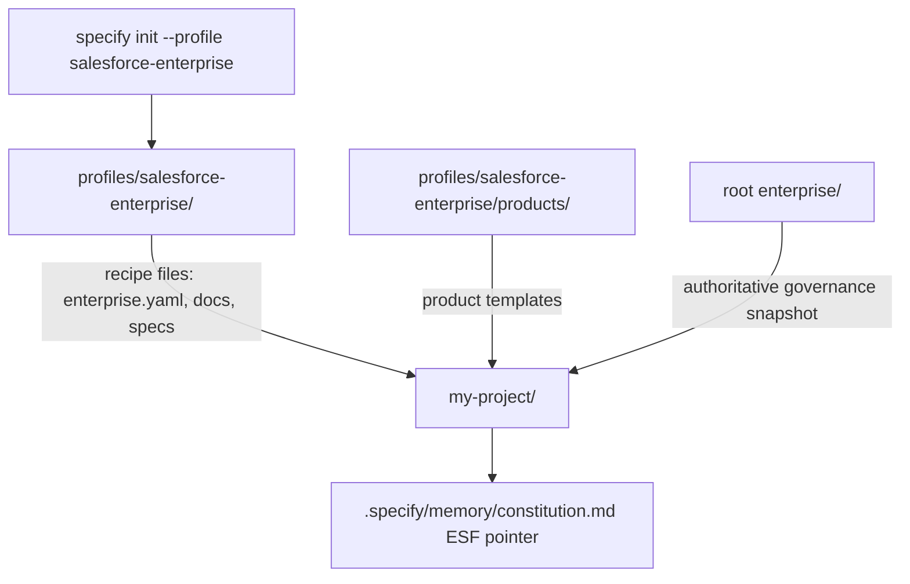

# ESF Project Bootstrap

## Purpose

The ESF Project Bootstrap profile lets product teams create an enterprise-ready Salesforce Spec Kit project in one command:

```bash
specify init my-project --integration codex --profile salesforce-enterprise
```

The profile is additive. Standard `specify init my-project --integration codex` behavior is unchanged when `--profile` is omitted.

## Architecture

```text
specify init
  |
  v
standard Spec Kit scaffold
  |
  v
optional profile installer
  |
  v
copy profile recipe files
  |
  v
copy root enterprise/ snapshot
  |
  v
write ESF-aware .specify/memory/constitution.md
```

The profile installer copies bootstrap recipe files from `profiles/salesforce-enterprise/` after the normal Spec Kit scaffold is installed. Enterprise Governance is not maintained in the profile. The installer copies the complete bundled root `enterprise/` hierarchy into `my-project/enterprise/` as a point-in-time snapshot, then rewrites `.specify/memory/constitution.md` as an ESF-aware top-level governance pointer. Existing files are preserved unless `--force` is used, except the Salesforce Enterprise profile intentionally updates the memory constitution so Spec Kit workflows see ESF governance.



## Generated Structure

```text
my-project/
|-- .specify/
|   `-- memory/
|       `-- constitution.md
|-- .agents/
|-- enterprise/
|   |-- constitution.md
|   |-- principles/
|   |-- salesforce/
|   `-- rules/
|-- products/
|   `-- sample-product/
|-- docs/
|   `-- esf-onboarding.md
|-- specs/
`-- enterprise.yaml
```

## Profile Configuration

The generated `enterprise.yaml` starts with:

```yaml
enterprise:
  version: 1.0

platform:
  name: Salesforce

product:
  name: sample-product

context:
  loadEnterprise: true
  loadProduct: true

governance:
  matcher: keyword
```

## Ownership

| Area | Owner | Purpose |
| --- | --- | --- |
| root `enterprise/` | Platform Team | Single source of truth for enterprise constitution, principles, Salesforce standards, rules, and knowledge packs. |
| generated `my-project/enterprise/` | Platform Team snapshot | Point-in-time copy of root Enterprise Governance produced during bootstrap. |
| `products/sample-product/` | Product Team | Product-specific principles, domain model, business rules, integrations, and event guidance. |
| `specs/` | Delivery Team | Feature specifications, plans, tasks, and governance reports. |
| `.specify/` | Spec Kit | Core workflows, templates, scripts, and integration metadata. |

## Memory Constitution

With `--profile salesforce-enterprise`, `.specify/memory/constitution.md` is generated as a compact ESF governance pointer. It tells `specify`, `plan`, implementation, and test workflows to use the ESF Context Loader and points them to the detailed runtime sources:

- `enterprise/constitution.md`
- `enterprise/salesforce/**`
- `enterprise/rule-packs/**`
- `enterprise/packs/**`
- `products/<product-name>/**`
- `enterprise.yaml`

The memory constitution does not duplicate detailed Salesforce rules. Root `enterprise/` and the generated `enterprise/` snapshot remain the detailed Enterprise Governance source of truth.

## Bootstrap Templates vs Runtime Governance

`profiles/salesforce-enterprise/` is a bootstrap recipe. It owns product starter templates, onboarding documentation, `enterprise.yaml`, and empty project folders. It does not own duplicate Enterprise Governance files such as `constitution.md`, security rules, Apex rules, architecture rules, Salesforce standards, or knowledge packs.

Runtime governance always lives in the generated project under:

```text
enterprise/
products/<product-name>/
```

The Enterprise Context Loader reads those runtime folders. It never reads governance content from `profiles/salesforce-enterprise/enterprise/`.

## Dynamic Product Context

Generated Salesforce Enterprise projects include a product folder selected by `enterprise.yaml`:

```yaml
product:
  name: sample-product
```

Product teams own files under `products/<product-name>/`, including:

- `principles.md`
- `domain-model.md`
- `business-rules.yaml`
- `events.md`
- `integrations.md`

The Enterprise Context Loader reads the selected product folder dynamically on each command run. If a team renames `products/sample-product/` to `products/product-team1/`, updates `enterprise.yaml`, and edits product files, future `/speckit-specify`, `/speckit-plan`, and `/speckit-implement` runs use the new product context automatically.

Enterprise rules remain platform-owned in `enterprise/`; product business rules remain product-owned in `products/<product-name>/business-rules.yaml`.

## Backward Compatibility

- `--profile` is optional.
- Only `salesforce-enterprise` is supported in v1.2.
- Existing init behavior, command names, integrations, validators, matchers, and governance engine behavior are unchanged.
- Invalid profile names fail clearly before project creation.

## Limitations

- The profile copies a complete Enterprise Governance snapshot into the project; it does not sync future enterprise updates.
- Knowledge-pack sync, remote rule fetching, CI/CD, and blocking governance are future capabilities.
- Product teams should rename `products/sample-product/` and update `enterprise.yaml` after initialization.
