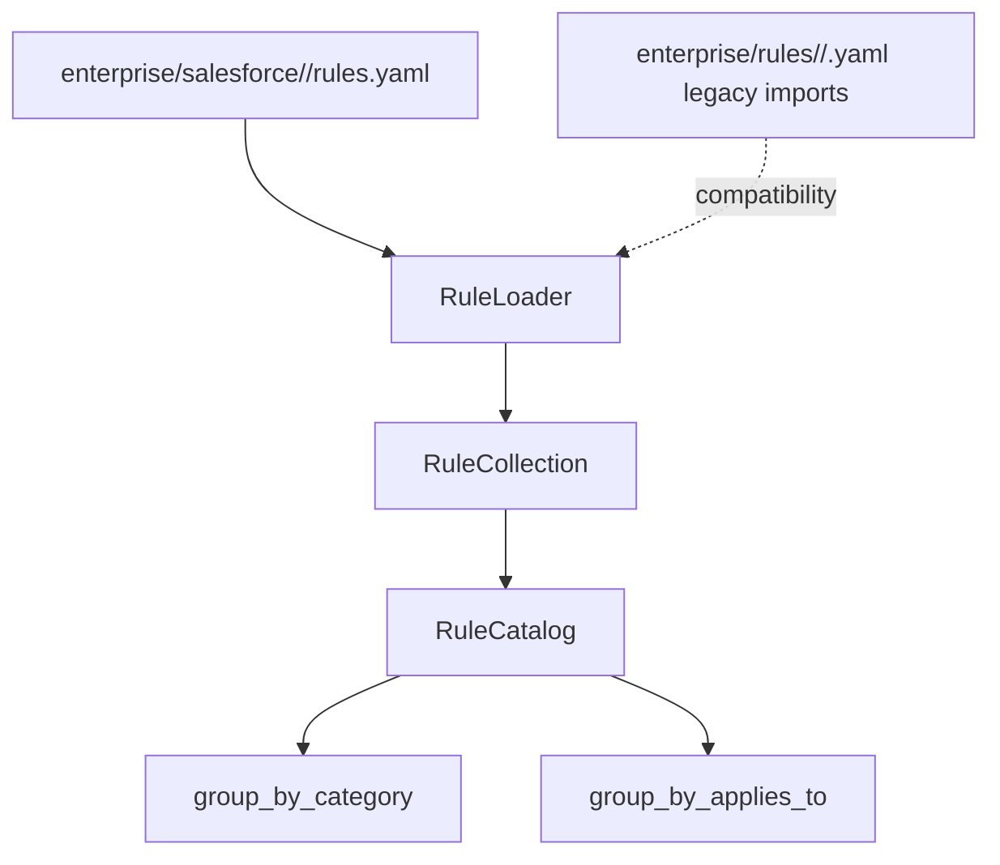

# Enterprise Rule Catalog

## Purpose

The Enterprise Rule Catalog is the machine-readable source of truth for governance rules in the Enterprise Spec Framework. It replaces embedded governance knowledge with rule data that future validators, prompt builders, and rule engines can load consistently.

Sprint 3.5 only defines and loads rules. It does not evaluate rules, perform keyword matching, enforce severity, block delivery, register CI gates, or replace Sprint 3 advisory validation behavior.

## Architecture



The catalog is intentionally separate from the Sprint 3 validator:

```text
Rule Catalog       Advisory Validator
     |                    |
     v                    v
  Rule data         Existing heuristics
     |                    |
     +---- Sprint 4 migration path ---->
```

## Rule Storage Model

ESF stores Salesforce governance rules as one `rules.yaml` file per Salesforce domain:

```text
enterprise/salesforce/
|-- security/rules.yaml
|-- apex/rules.yaml
|-- architecture/rules.yaml
|-- flow/rules.yaml
|-- lwc/rules.yaml
|-- integration/rules.yaml
|-- testing/rules.yaml
|-- governance/rules.yaml
|-- compliance/rules.yaml
|-- devops/rules.yaml
|-- observability/rules.yaml
|-- deployment/rules.yaml
|-- performance/rules.yaml
|-- data/rules.yaml
`-- monitoring/rules.yaml
```

This replaced the earlier one-rule-per-file repository model. The domain file model reduces repository noise, keeps related rules reviewable together, and makes domain ownership clearer. Legacy single-rule files are still supported by `RuleLoader` for imported projects, but new repository rules must be added to `enterprise/salesforce/<domain>/rules.yaml`.

Each domain file contains a top-level `rules` list. Preserve ordering by appending new rules in ID order when practical. Rule IDs must remain globally unique across all domain files.

## Rule Schema

Required fields:

| Field | Type | Purpose |
| --- | --- | --- |
| `id` | string | Stable rule identifier, such as `SEC-001`. |
| `title` | string | Short human-readable rule name. |
| `category` | string | Governance category, such as `Security` or `Apex`. |
| `description` | string | What the rule expects. |
| `rationale` | string | Why the rule exists. |
| `severity` | string | Current advisory severity. Sprint 3.5 does not enforce severity. |
| `default_enabled` | boolean | Whether future engines should enable the rule by default. |
| `applies_to` | list of strings | Artifact or technology targets, such as `specification`, `plan`, `tasks`, `apex`, `flow`, or `lwc`. |
| `keywords` | list of strings | Terms future advisory engines may use for coverage checks. Sprint 3.5 does not match keywords. |
| `recommendation` | string | Suggested action when the rule is relevant. |
| `references` | list of strings | Supporting standards, guides, or policy references. |
| `owner` | string | Owning team. Enterprise rules are owned by `Platform Team`. |
| `version` | string | Rule version, such as `"1.0"`. |

Example:

```yaml
rules:
  - id: SFSEC-001
    title: CRUD/FLS Enforcement
    category: Salesforce Security
    description: All Apex data access must describe how object and field permissions are enforced.
    rationale: Enterprise security policy requires object and field permission enforcement before data is read or changed.
    severity: advisory
    default_enabled: true
    applies_to:
      - specification
      - plan
      - apex
    keywords:
      - CRUD
      - FLS
      - field-level security
    recommendation: Explicitly describe CRUD/FLS enforcement for each Salesforce object and field touched by the feature.
    references:
      - Salesforce Secure Coding Guide
    owner: Platform Team
    version: "1.0"
```

## Rule Authoring

To add or update a rule:

1. Open `enterprise/salesforce/<domain>/rules.yaml`.
2. Add one item to the `rules` list.
3. Keep the rule ID unique and stable.
4. Keep the rule near related rules or in ID order.
5. Include evidence, recommendations, metadata, and references when applicable.
6. Run `python scripts/load-rules.py --list` and the rule catalog tests.

## Optional and Future Fields

The loader preserves unknown fields in a rule's `metadata` payload. This allows future schema additions without breaking older consumers.

ESF v1.1 adds optional Salesforce Practice Compliance fields:

```yaml
practice:
  type: salesforce_apex_bulkification
  min_confidence: 0.7
required_evidence:
  - processes records in collections
negative_evidence:
  - DML inside loop
evidence_terms:
  processes records in collections:
    - collections
    - bulk records
  DML inside loop:
    - DML inside loop
```

These fields are consumed only when the opt-in practice matcher is selected. Existing keyword-only rules remain valid.

Likely future fields:

- `tags`
- `source_document`
- `effective_date`
- `deprecated`
- `replacement_rule`
- `products`
- `exceptions_allowed`
- `automation`
- `evidence`

Older tools should ignore unknown fields. New tools should treat missing future fields as absent rather than invalid.

## Schema Evolution

Rules are versioned independently using the `version` field. Compatible edits include:

- Clarifying descriptions or recommendations.
- Adding references.
- Adding keywords.
- Adding optional fields.

Potentially breaking edits include:

- Changing a stable `id`.
- Changing category semantics.
- Removing required fields.
- Changing `applies_to` in a way that removes expected coverage.

Breaking edits should create a new rule ID or include a migration note in a future optional field.

## Ownership

- Platform Team owns `enterprise/salesforce/<domain>/rules.yaml`.
- Product Teams may add product-specific rule packs in a later sprint.
- Delivery Teams consume rule output and should not edit enterprise rules.

## Rule Lifecycle

```text
Draft rule
  |
  v
Platform architecture review
  |
  v
Catalog merge
  |
  v
Advisory use by validators and agents
  |
  v
Rule version update or retirement
```

## CLI Usage

List all rule IDs:

```bash
python scripts/load-rules.py --list
```

Load one category:

```bash
python scripts/load-rules.py --category security
python scripts/load-rules.py --category governance
```

Render JSON:

```bash
python scripts/load-rules.py --json
```

Render YAML:

```bash
python scripts/load-rules.py --yaml
```

Use an explicit root:

```bash
python scripts/load-rules.py --root . --category security --json
```

## Limitations

- No rule engine exists yet.
- No validation behavior changes in Sprint 3.5.
- No keyword matching is performed.
- No severity enforcement is performed.
- No product-specific rule packs are loaded yet.
- No CI integration or blocking workflow is introduced.

## Future Rule Engine

Sprint 4 can consume `RuleCollection` and map rule definitions to validation behavior. The expected migration path is:

1. Load enterprise rules through `RuleLoader`.
2. Select rules by `applies_to`.
3. Evaluate rules using a dedicated rule engine.
4. Produce findings using the existing report model or a compatible successor.
5. Keep advisory behavior as the default.

## Future Validation

Future validation should treat the catalog as data and avoid embedding governance text directly in Python. The validator may still contain reusable evaluation logic, but the rule definitions, categories, keywords, recommendations, references, and ownership should come from YAML rule files.
